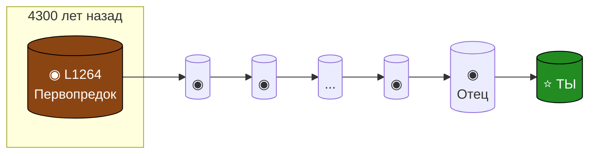
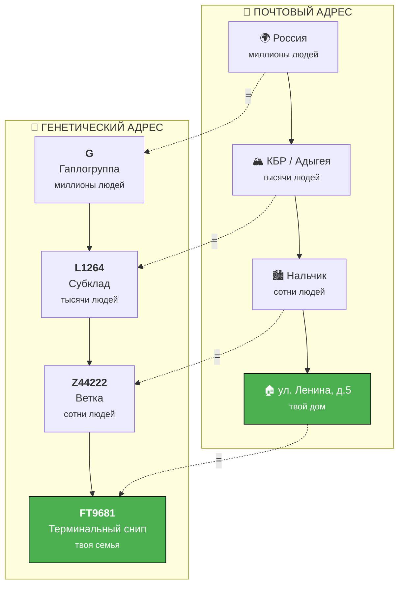
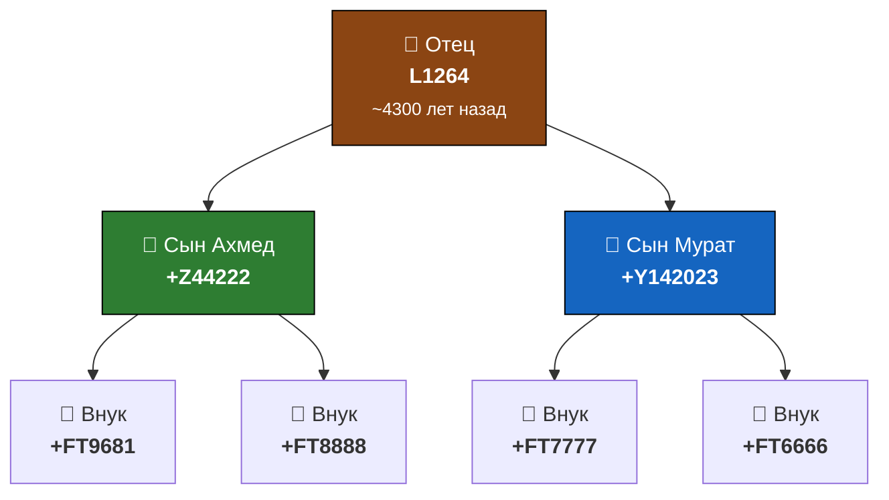

# Визуальные схемы для путеводителя AADNA

Эти схемы можно использовать как иллюстрации к главам. Они созданы в текстовом формате (ASCII) для простоты копирования, а также в формате Mermaid для генерации картинок.

---

## Схема 1: Для Главы 0 — «Цепочка поколений»

Эмоциональная схема — путь от древнего предка к тебе.

### Текстовая версия:

```
    ╔═══════════════════════════════════════════════════════════════╗
    ║                    ТВОЙ ГЕНЕТИЧЕСКИЙ АДРЕС                    ║
    ╚═══════════════════════════════════════════════════════════════╝
    
         4300 лет назад              Сегодня
              │                          │
              ▼                          ▼
    ┌─────────────────────────────────────────────────────────────┐
    │  ◉ ─── ◉ ─── ◉ ─── ◉ ─── ◉ ─── ◉ ─── ... ─── ◉ ─── ◉       │
    │  │     │     │     │     │     │           │     │         │
    │  L1264 │     │     │     │     │           │    ТЫ         │
    │        │     │     │     │     │           │               │
    │   Предок    Сын  Внук  ...   ...         Отец              │
    └─────────────────────────────────────────────────────────────┘
    
              ~170 поколений = одна непрерывная линия
```

### Mermaid-версия:



---

## Схема 2: Для Главы 1 — «Почтовый адрес»

Главная обучающая схема — аналогия генетического адреса с почтовым.

### Текстовая версия:

```
    ╔════════════════════════════════════════════════════════════════╗
    ║              ГЕНЕТИЧЕСКИЙ АДРЕС = ПОЧТОВЫЙ АДРЕС               ║
    ╚════════════════════════════════════════════════════════════════╝
    
    
        ПОЧТОВЫЙ АДРЕС                    ГЕНЕТИЧЕСКИЙ АДРЕС
        ══════════════                    ══════════════════
    
    ┌───────────────────┐             ┌───────────────────┐
    │      Россия       │    ═══►     │    Гаплогруппа    │     G
    │   (миллионы)      │             │    (миллионы)     │
    └────────┬──────────┘             └────────┬──────────┘
             │                                 │
             ▼                                 ▼
    ┌───────────────────┐             ┌───────────────────┐
    │    КБР / Адыгея   │    ═══►     │      Субклад      │   L1264
    │    (тысячи)       │             │    (тысячи)       │
    └────────┬──────────┘             └────────┬──────────┘
             │                                 │
             ▼                                 ▼
    ┌───────────────────┐             ┌───────────────────┐
    │  Нальчик/Майкоп   │    ═══►     │   Ветка древа     │  Z44222
    │     (сотни)       │             │    (сотни)        │
    └────────┬──────────┘             └────────┬──────────┘
             │                                 │
             ▼                                 ▼
    ┌───────────────────┐             ┌───────────────────┐
    │  ул. Ленина, д.5  │    ═══►     │Терминальный снип  │  FT9681
    │   (твой дом)      │             │  (твоя семья)     │
    └───────────────────┘             └───────────────────┘
    
    
           Чем точнее адрес — тем легче тебя найти!
```

### Mermaid-версия:



---

## Схема 3: Для Главы 1 — «Чтение цепочки»

Как читать результат теста.

### Текстовая версия:

```
    ╔═══════════════════════════════════════════════════════════════════╗
    ║                     КАК ЧИТАТЬ СВОЮ ЦЕПОЧКУ                       ║
    ╚═══════════════════════════════════════════════════════════════════╝
    
    
      ДРЕВНОСТЬ ◄──────────────────────────────────────► СОВРЕМЕННОСТЬ
    
    
       Adam > ... > G > P15 > L1264 > Z44222 > FT9681
         │           │    │      │        │        │
         │           │    │      │        │        └──► ТЫ (твоя семья)
         │           │    │      │        │
         │           │    │      │        └──► Твой клан (~500 лет)
         │           │    │      │
         │           │    │      └──► Адыго-абхазы (~4300 лет)
         │           │    │
         │           │    └──► Ветвь G2a (~18 000 лет)
         │           │
         │           └──► Гаплогруппа G (~25 000 лет)
         │
         └──► Общий предок всех мужчин (~200 000 лет)
    
    
    ┌──────────────────────────────────────────────────────────────────┐
    │  ПРАВИЛО: Последний код справа = твой «номер квартиры»          │
    │           Чем правее совпадение с другим — тем ближе родство    │
    └──────────────────────────────────────────────────────────────────┘
```

---

## Схема 4: Для Главы 2 — «Башня из кирпичиков»

Как накапливаются мутации (снипы).

### Текстовая версия:

```
    ╔═══════════════════════════════════════════════════════════════╗
    ║               СНИПЫ — ЭТО КИРПИЧИКИ БАШНИ                     ║
    ╚═══════════════════════════════════════════════════════════════╝
    
    
              ТВОЯ БАШНЯ                         ЧТО ЭТО ЗНАЧИТ
              ══════════                         ══════════════
    
                ┌───┐
           ТЫ → │FT9│ ← Твой кирпичик           ~100 лет назад
                ├───┤
          Дед → │ ? │ ← Ещё не открыт           ~200 лет назад
                ├───┤
     Прадед → │ ? │                            ~300 лет назад
                ├───┤
              │...│                              ...
                ├───┤
        Клан → │Z44│ ← Общий с соседями         ~500 лет назад
                ├───┤
              │...│                              ...
                ├───┤
       Народ → │L12│ ← L1264, адыго-абхазы     ~4300 лет назад
                ├───┤
              │...│                              ...
                ├───┤
   Древность → │ G │ ← Гаплогруппа G           ~25000 лет назад
                └───┘
              ФУНДАМЕНТ
    
    
    ┌─────────────────────────────────────────────────────────────────┐
    │  Каждое поколение добавляет ~1 кирпичик (снип)                  │
    │  Все кирпичики отца переходят к сыну + его собственный          │
    │  Башня только растёт вверх — кирпичики никогда не убираются     │
    └─────────────────────────────────────────────────────────────────┘
```

---

## Схема 5: Для Главы 2 — «Ветвление древа»

Как появляются ветви.

### Текстовая версия:

```
    ╔═══════════════════════════════════════════════════════════════╗
    ║                  КАК ДРЕВО РАЗВЕТВЛЯЕТСЯ                      ║
    ╚═══════════════════════════════════════════════════════════════╝
    
    
                          Отец (L1264)
                               │
                 ┌─────────────┴─────────────┐
                 │                           │
            Сын Ахмед                    Сын Мурат
          (новый снип:                 (новый снип:
            Z44222)                      Y142023)
                 │                           │
           ┌─────┴─────┐               ┌─────┴─────┐
           │           │               │           │
        Внук 1      Внук 2          Внук 3      Внук 4
       (FT9681)    (FT8888)        (FT7777)    (FT6666)
    
    
    ┌─────────────────────────────────────────────────────────────────┐
    │  • Оба сына получили снип отца (L1264)                          │
    │  • Каждый добавил свой уникальный снип                          │
    │  • Потомки Ахмеда НИКОГДА не получат снип Y142023               │
    │  • Потомки Мурата НИКОГДА не получат снип Z44222                │
    │  • Ветви разошлись НАВСЕГДА                                     │
    └─────────────────────────────────────────────────────────────────┘
```

### Mermaid-версия:



---

## Схема 6: Для Главы 2 — «Бутылочное горлышко»

Что означает длинная линия без ветвлений.

### Текстовая версия:

```
    ╔═══════════════════════════════════════════════════════════════╗
    ║        БУТЫЛОЧНОЕ ГОРЛЫШКО vs ЗВЁЗДНЫЙ ВЗРЫВ                  ║
    ╚═══════════════════════════════════════════════════════════════╝
    
    
       БУТЫЛОЧНОЕ ГОРЛЫШКО              ЗВЁЗДНЫЙ ВЗРЫВ
       (род едва выжил)                 (род процветал)
    
              │                              │
              │                        ┌──┬──┼──┬──┐
              │                        │  │  │  │  │
              │                        ▼  ▼  ▼  ▼  ▼
              │ 2000 лет              множество веток
              │ без ветвлений              │
              │                      ┌──┬──┼──┬──┐
              │                      ▼  ▼  ▼  ▼  ▼
              ▼                     ещё больше веток
    
    
     «Одинокий путник»              «Расцвет рода»
     ─────────────────              ────────────────
     В каждом поколении             У предка много
     выживал только                 сыновей, у каждого
     один сын. Братья               тоже много детей.
     погибали.                      Род расширяется.
    
    
    ┌─────────────────────────────────────────────────────────────────┐
    │  Форма твоей ветки — это отпечаток истории твоего рода          │
    └─────────────────────────────────────────────────────────────────┘
```

---

## Схема 7: Для Главы 3 — «Два инструмента»

YFull и GEDmatch — разные задачи.

### Текстовая версия:

```
    ╔═══════════════════════════════════════════════════════════════╗
    ║              ДВА ИНСТРУМЕНТА — ДВЕ ЗАДАЧИ                     ║
    ╚═══════════════════════════════════════════════════════════════╝
    
    
                    YFull                        GEDmatch
                 ═══════════                   ═══════════
    
                 Y-хромосома                    Аутосомы
                      │                             │
                      │                             │
                 ┌────┴────┐                   ┌────┴────┐
                 │  ГЛУБИНА │                  │ ШИРОТА  │
                 │ тысячи   │                  │ сотни   │
                 │   лет    │                  │  лет    │
                 └────┬────┘                   └────┬────┘
                      │                             │
                      ▼                             ▼
           ┌─────────────────┐           ┌─────────────────┐
           │ Древние корни   │           │ Живые кузены    │
           │ Клан, народ     │           │ 3-5-юродные     │
           │ История рода    │           │ Фамилии, сёла   │
           └─────────────────┘           └─────────────────┘
    
    
    ┌────────────────────────────────────────────────────────────────┐
    │                         СРАВНЕНИЕ                              │
    ├────────────────┬──────────────────┬────────────────────────────┤
    │                │      YFull       │         GEDmatch           │
    ├────────────────┼──────────────────┼────────────────────────────┤
    │ Что ищет       │ Y-хромосому      │ Аутосомы (все линии)       │
    │ Глубина        │ Тысячи лет       │ 200-300 лет                │
    │ Находит        │ Кланы, народы    │ Троюродных братьев         │
    │ Стоимость      │ $49 (разово)     │ Бесплатно                  │
    │ Для кого       │ Только мужчины   │ Мужчины и женщины          │
    └────────────────┴──────────────────┴────────────────────────────┘
    
                   ЛУЧШИЙ РЕЗУЛЬТАТ: использовать ОБА
```

---

## Схема 8: Для Главы 4 — «Пирамида тестов»

Чем WGS отличается от других тестов.

### Текстовая версия:

```
    ╔═══════════════════════════════════════════════════════════════╗
    ║                    ПИРАМИДА ДНК-ТЕСТОВ                        ║
    ╚═══════════════════════════════════════════════════════════════╝
    
    
                          ◄── ТВОЙ ТЕСТ
                           ╱╲
                          ╱  ╲
                         ╱ WGS╲        Полный геном
                        ╱ $500 ╲       Читает ВСЁ
                       ╱────────╲      Не устареет
                      ╱          ╲
                     ╱   BigY     ╲    Только Y-хромосома
                    ╱   $400       ╲   Хороший, но неполный
                   ╱────────────────╲
                  ╱                  ╲
                 ╱  SNP-панели/чипы   ╲  Проверяет известные мутации
                ╱      $100-200        ╲ Может пропустить новые
               ╱────────────────────────╲
              ╱                          ╲
             ╱     STR-маркеры (37-111)   ╲  Предсказывает (может ошибиться)
            ╱          $50-150             ╲ Устаревает быстро
           ╱────────────────────────────────╲
    
    
    ┌────────────────────────────────────────────────────────────────┐
    │  ЧЕМ ВЫШЕ — ТЕМ ЛУЧШЕ                                          │
    │                                                                │
    │  WGS читает весь геном: Y-ДНК + мтДНК + аутосомы + медицина    │
    │  Это документ на всю жизнь — не нужно пересдавать              │
    └────────────────────────────────────────────────────────────────┘
```

---

## Схема 9: Для Главы 4 — «Паспорт vs Фоторобот»

Снипы vs Маркеры.

### Текстовая версия:

```
    ╔═══════════════════════════════════════════════════════════════╗
    ║              МАРКЕРЫ vs СНИПЫ: ФОТОРОБОТ vs ПАСПОРТ           ║
    ╚═══════════════════════════════════════════════════════════════╝
    
    
         МАРКЕРЫ (STR)                        СНИПЫ (SNP)
         ══════════════                       ══════════════
    
       ┌─────────────────┐               ┌─────────────────┐
       │                 │               │                 │
       │   📝 ФОТОРОБОТ  │               │  📘 ПАСПОРТ     │
       │                 │               │                 │
       │  "Рост ~175 см  │               │  "Иванов И.И.   │
       │   Нос с горб.   │               │   Серия: 1234   │
       │   Волосы тёмн." │               │   № 567890"     │
       │                 │               │                 │
       └─────────────────┘               └─────────────────┘
    
            ГАДАНИЕ                           ФАКТ
           (90-99%)                          (100%)
    
    
    ┌────────────────────────────────────────────────────────────────┐
    │                         СРАВНЕНИЕ                              │
    ├────────────────┬───────────────────┬───────────────────────────┤
    │                │    Маркеры (STR)  │      Снипы (SNP)          │
    ├────────────────┼───────────────────┼───────────────────────────┤
    │ Суть           │ Приметы, описание │ Документ с номером        │
    │ Точность       │ Предсказание      │ Факт                      │
    │ Мутируют       │ Туда и обратно    │ Только вперёд             │
    │ Результат      │ "Похоже на G2a"   │ "Точно G-FT9681"          │
    │ Цена           │ Дешевле           │ Дороже                    │
    │ Надёжность     │ Может ошибиться   │ Не ошибается              │
    └────────────────┴───────────────────┴───────────────────────────┘
    
                 У тебя есть ПАСПОРТ — это твой WGS!
```

---

## Схема 10: Для AADNA — «Древо L1264»

Специальная схема для участников проекта.

### Текстовая версия:

```
    ╔═══════════════════════════════════════════════════════════════╗
    ║              ДРЕВО G-L1264: АДЫГО-АБХАЗСКИЙ РОД               ║
    ╚═══════════════════════════════════════════════════════════════╝
    
    
                              L1266
                          (~7800 лет назад)
                                │
                    ┌───────────┴───────────┐
                    │                       │
                 L1264                   Y18370
            (~4300 лет)             (Западная Грузия)
                    │
         ┌──────────┴──────────┐
         │                     │
     FGC21495               Y513104
         │                     │
    ┌────┴────┐          ┌─────┴─────┐
    │         │          │           │
  S9409   Z44145      Y142023    Z44222 ◄── Самая массовая ветка
    │         │          │           │
   ...       ...        ...    ┌────┬────┬────┬────┐
                               │    │    │    │    │
                             FT... FT... FT... FT9681
                                                 │
                                               ТЫ?
    
    
    ┌────────────────────────────────────────────────────────────────┐
    │  L1264 — это «адыго-абхазский» субклад                         │
    │  Общий предок всех L1264 жил ~4300 лет назад на Кавказе        │
    │  Сегодня это тысячи потомков — кабардинцы, адыгейцы, абхазы... │
    └────────────────────────────────────────────────────────────────┘
```

---

## Как использовать эти схемы

1. **В Markdown-документах** — копируйте текстовые версии напрямую
2. **На сайте** — используйте Mermaid-версии (рендерятся автоматически)
3. **Для печати** — экспортируйте Mermaid в PNG через [mermaid.live](https://mermaid.live)
4. **В презентациях** — скриншоты текстовых версий или экспорт Mermaid

---

## Цветовая схема для Mermaid

Рекомендуемые цвета для единообразия:

- **Древность / Корни:** `#8B4513` (коричневый)
- **Современность / Ты:** `#228B22` (зелёный)  
- **Промежуточные ветки:** `#2E7D32`, `#1565C0`
- **Акценты:** `#4CAF50` (светло-зелёный)
