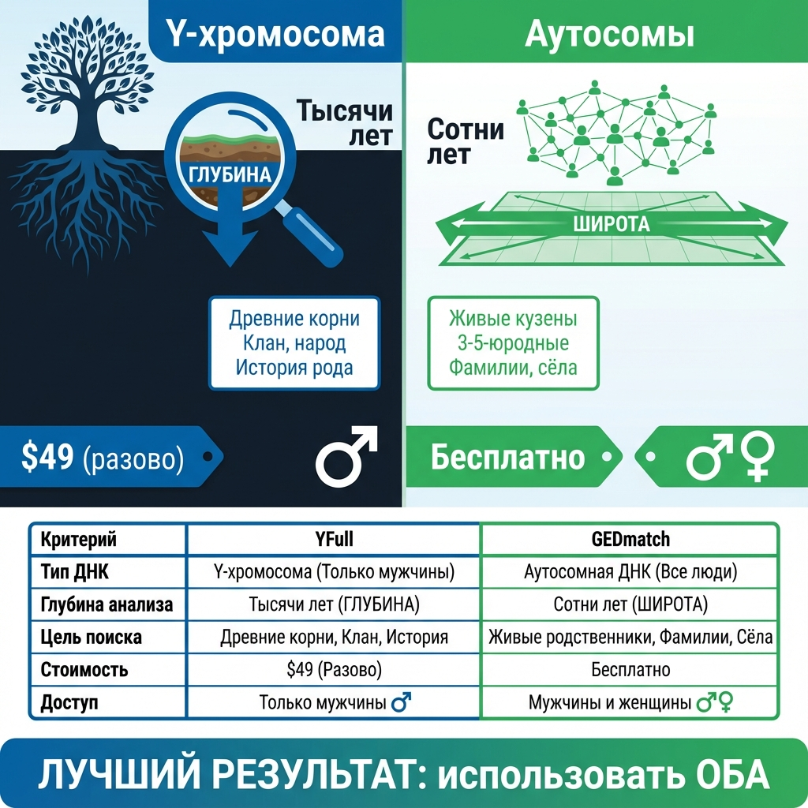
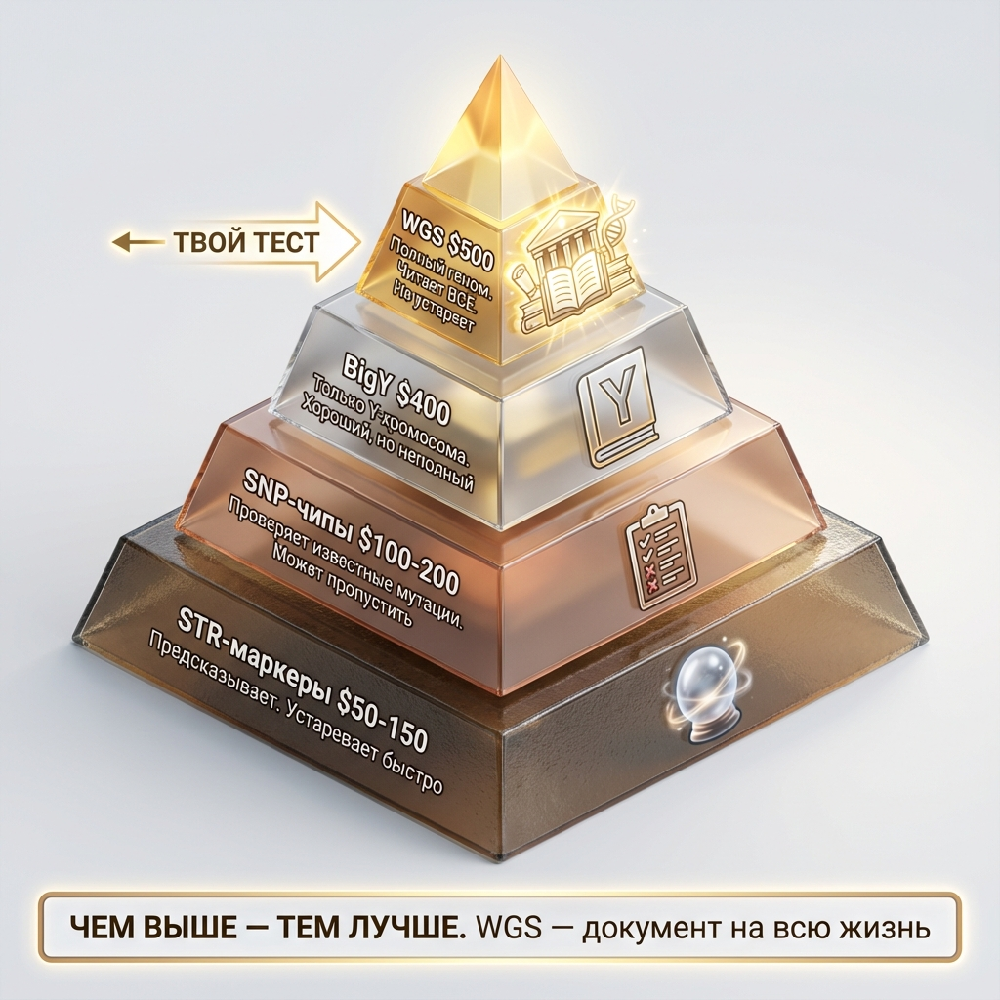
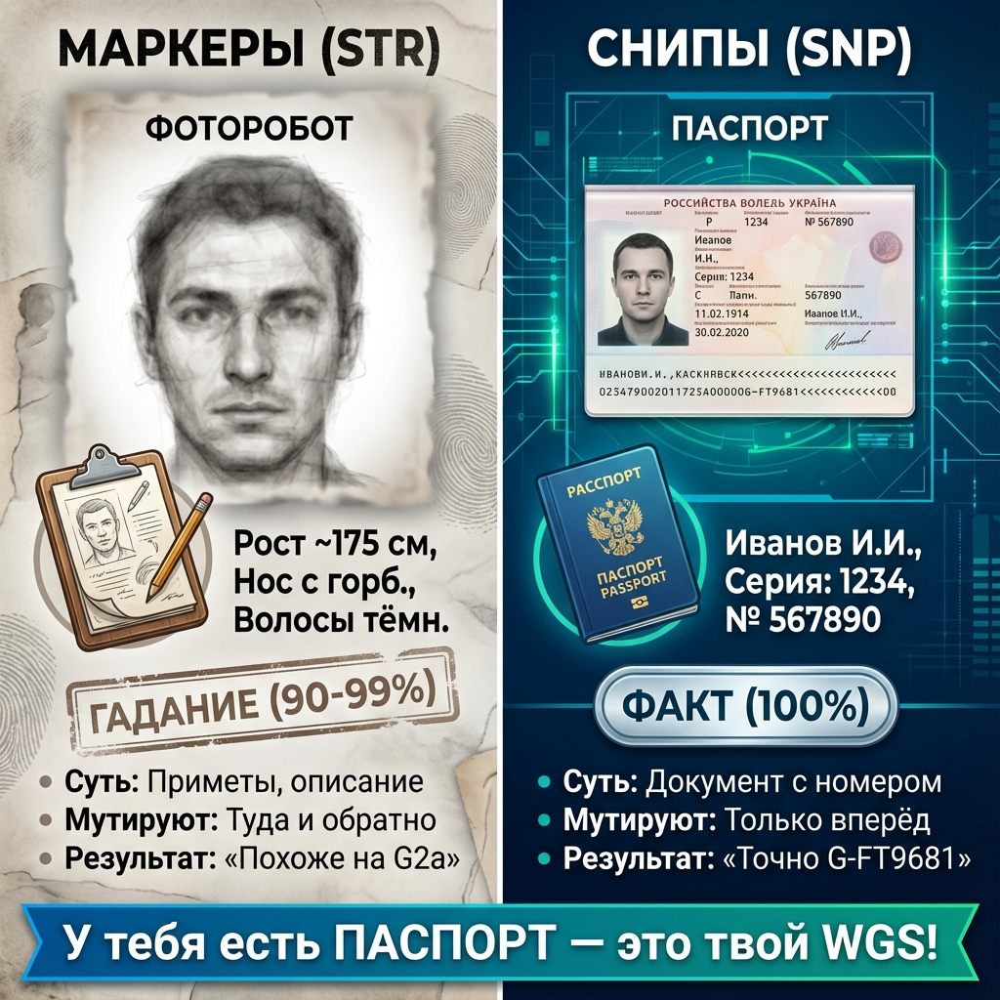

# 🎨 Галерея Визуальных Схем

Все схемы сгенерированы на основе промптов из [01_Visual_Schemes_Prompts.md](./01_Visual_Schemes_Prompts.md).

---

## Схема 1: Цепочка Поколений (Глава 0)
*170 поколений от древнего предка до тебя.*

## Схема 2: Почтовый Адрес (Глава 1)
*Аналогия генетического адреса с почтовым.*

## Схема 3: Чтение Цепочки (Глава 1)
*Как читать результат теста — от Adam до тебя.*

## Схема 4: Башня из Кирпичиков (Глава 2)
*Как накапливаются снипы поколение за поколением.*

## Схема 5: Ветвление Древа (Глава 2)
*Как появляются ветви — от отца к сыновьям.*

## Схема 6: Бутылочное Горлышко vs Звёздный Взрыв (Глава 2)
*Два паттерна: род едва выжил vs род процветал.*

## Схема 7: YFull vs GEDmatch (Глава 3)
*Два инструмента — две задачи.*

## Схема 8: Пирамида ДНК-Тестов (Глава 4)
*WGS на вершине — документ на всю жизнь.*

## Схема 9: Паспорт vs Фоторобот (Глава 4)
*Снипы = факт, маркеры = гадание.*

## Схема 10: Древо G-L1264 (AADNA)
*Адыго-абхазский субклад — от корня до твоей ветки.*

