# ДНК-генеалогия: Полный путеводитель AADNA

*Версия от 31 декабря 2025 г.*

---

## Оглавление

1. [Введение](#введение)
2. [Часть 1. Основы](#часть-1-основы)
    *   [Глава 0. У тебя есть адрес](#глава-0-у-тебя-есть-адрес)
    *   [Глава 1. Как прочитать свой адрес](#глава-1-как-прочитать-свой-адрес)
    *   [Глава 2. Как растёт древо](#глава-2-как-растёт-древо)
    *   [Глава 3. Женская линия (mtDNA)](#глава-3-женская-линия-mtdna)
    *   [Глава 4. Поиск родственников (Аутосомы)](#глава-4-поиск-родственников-аутосомы)
3. [Часть 2. Технические детали](#часть-2-технические-детали)
    *   [Глава 5. Файлы и технические детали](#глава-5-файлы-и-технические-детали)
4. [Часть 3. История ветвей](#часть-3-история-ветвей)
    *   [Обзор ветки G-L1264](#обзор-ветки-g-l1264)
    *   [G-FGC21495: Тихие хранители](#g-fgc21495-тихие-хранители)
    *   [G-S9409: Древняя аристократия](#g-s9409-древняя-аристократия)
    *   [G-Y513104: Река, ставшая морем](#g-y513104-река-ставшая-морем)
    *   [G-Z44222: Звезда Кабарды](#g-z44222-звезда-кабарды)
    *   [R1a-YP457: Кабардинские князья](#r1a-yp457-кабардинские-князья)
5. [Часть 4. Специальные модули](#часть-4-специальные-модули)
    *   [Мухаджирский модуль](#мухаджирский-модуль)
    *   [Если у тебя редкая ветвь](#если-у-тебя-редкая-ветвь)
6. [Часть 5. Справочник](#часть-5-справочник)
    *   [FAQ: Частые вопросы](#faq-частые-вопросы)
    *   [Глоссарий терминов](#глоссарий-терминов)

---

## Введение

### Добро пожаловать в проект!

Вы получили результаты полногеномного теста (WGS) — самого полного ДНК-анализа в мире. Обычная цена такого теста в России 80 тысяч рублей.

**Этот гид поможет вам:**
- Понять, что означают ваши результаты
- Научиться читать своё место на древе
- Найти родственников
- Сохранить данные для будущих поколений

### О проекте AADNA

AADNA — проект по изучению генетической истории адыго-абхазских народов. Мы собираем данные, чтобы:
- Построить детальное древо Y-хромосомы
- Найти связи между родами и фамилиями
- Восстановить историю миграций
- Помочь участникам найти родственников

**Каждый новый участник уточняет историю всех.**

> *«ДНК-генеалогия — как машина времени. Можно представить своих предков где-то в горах Кавказа четыре тысячи лет назад. А если повезёт найти совпадение с древней ДНК — чувства просто непередаваемые.»*
>
> — Участник проекта AADNA

---

# Часть 1. Основы

## Глава 0. У тебя есть адрес

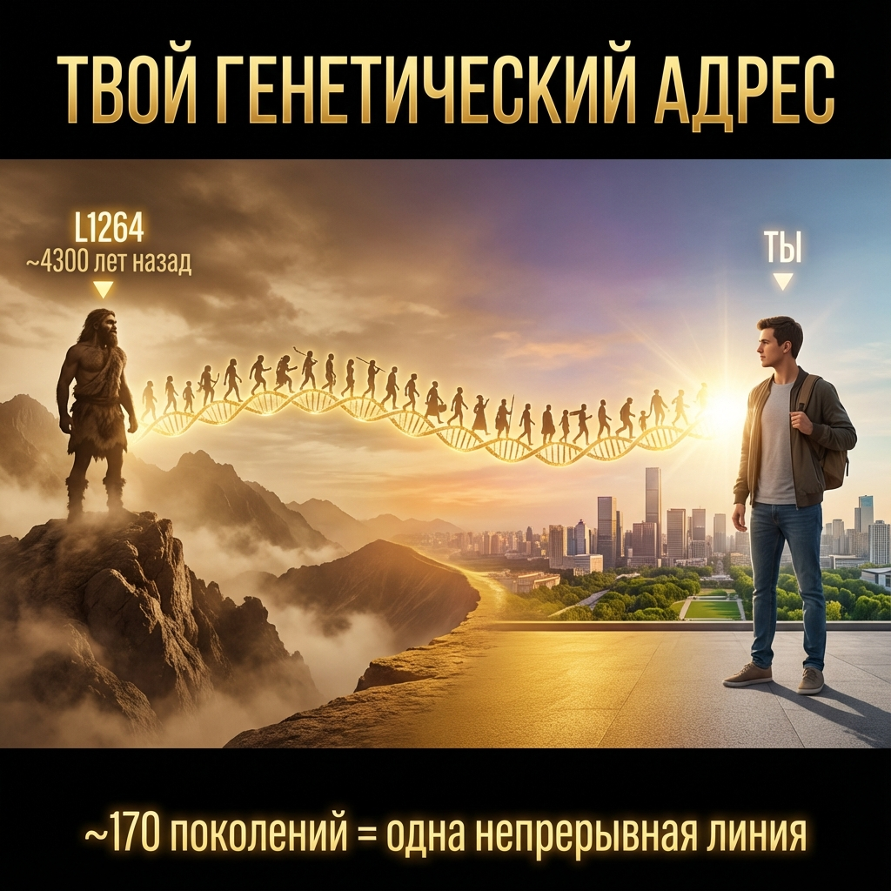


Где-то в горах Западного Кавказа, четыре тысячи лет назад, жил человек.

Он не знал письменности. Не оставил дневников. Его имя забыто.

> [!TIP] 🖼️ **Иллюстрация: Твой предок**
> 

Но он оставил кое-что получше — **тебя**.

---

Каждый раз, когда рождался сын, в его теле появлялась крошечная метка. Случайная. Невидимая. Одна на миллиард букв генетического кода.

> [!TIP] 🖼️ **Иллюстрация: Мутация (SNP)**
> *До и После: Как одна буква меняет всё.*
> 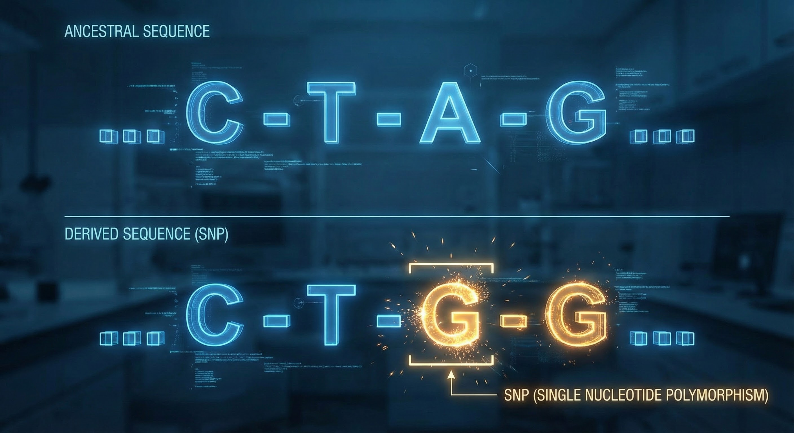
> 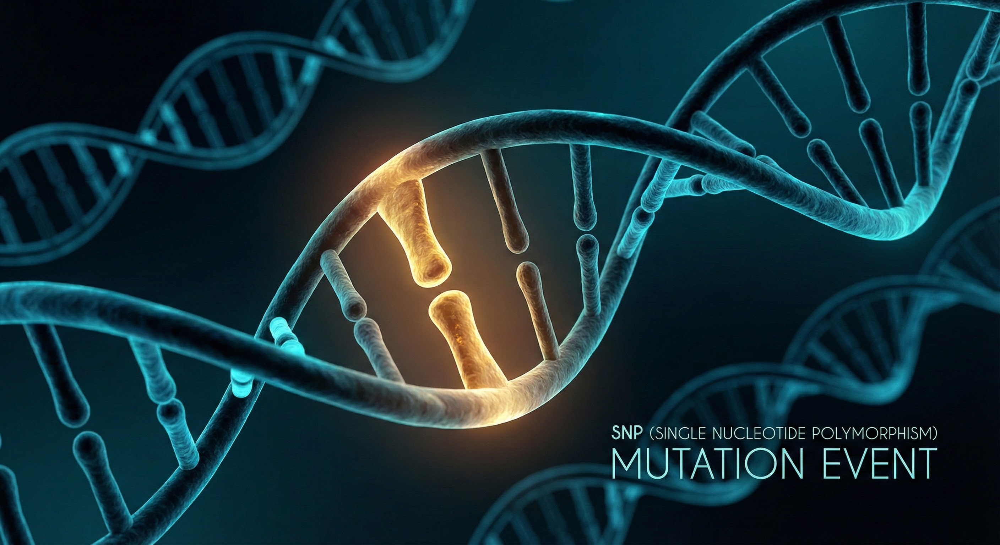

Эта метка передавалась дальше. От сына к внуку. От внука к правнуку.

Тысячи лет. Сотни поколений. Войны, переселения, империи — а метка всё ещё здесь.

**Она в тебе.**

---

Теперь представь: таких меток у тебя не одна. Их сотни.

Каждая — след конкретного предка. Каждая — развилка на дороге истории.

Вместе они складываются в уникальный код. Как номер паспорта, только древнее.

**Это твой генетический адрес.**

> [!TIP] 🖼️ **Иллюстрация: Генетический паспорт**
> *Сотни развилок истории, ведущие к вам.*
> 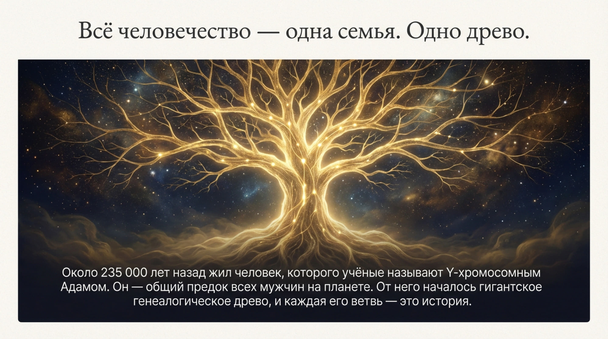

### Что можно сделать с этим адресом?

**1. Найти родственников.**
В мире есть люди с похожим кодом. Некоторые — дальние (общий предок жил 2000 лет назад). Некоторые — близкие (общий предок жил 300 лет назад, и это, возможно, твой прапрадед). Кто-то из них живёт в Турции, Иордании, Сирии — потомки мухаджиров, уехавших 160 лет назад. Генетика может вас воссоединить.

**2. Узнать, откуда твой род.**
Код расскажет, где жили твои предки. Не «примерно Кавказ», а конкретнее: какая ветвь древа, какой период, какие соседние рода.

**3. Увидеть свою линию на карте человечества.**
Существует огромное дерево — генеалогия всех мужчин планеты. Твой адрес показывает, где именно на этом дереве находишься ты. Если ты носитель **L1264** — ты часть адыго-абхазской ветви, которой около **4400 лет**.

### Что ты уже получил

Ты сдал тест. Лаборатория прочитала твой код — все три миллиарда букв.

Это **WGS** — полногеномное секвенирование. Самый полный анализ, который существует.

Теперь у тебя есть файлы с результатами. В них — всё: история отцовской линии, материнской линии, данные для поиска родни, даже медицинская информация.

**Но файлы сами по себе — просто буквы.**

Чтобы они заговорили, нужно научиться одной вещи: **читать древо**.

---

## Глава 1. Как прочитать свой адрес

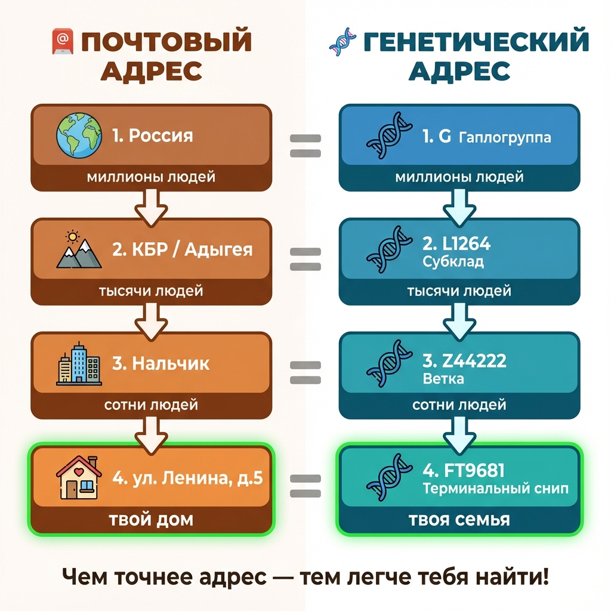

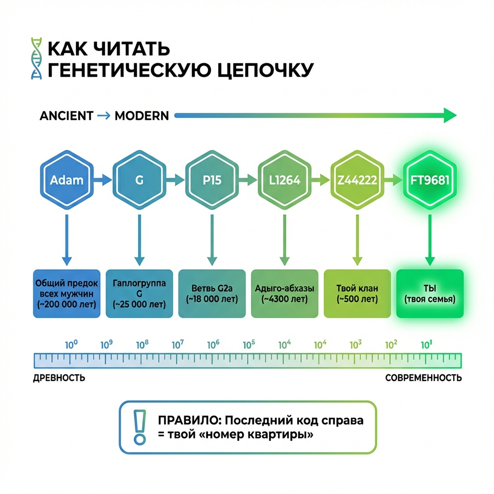

> [!TIP] 🖼️ **Иллюстрация: Y-Хромосома — Машина Времени**
> 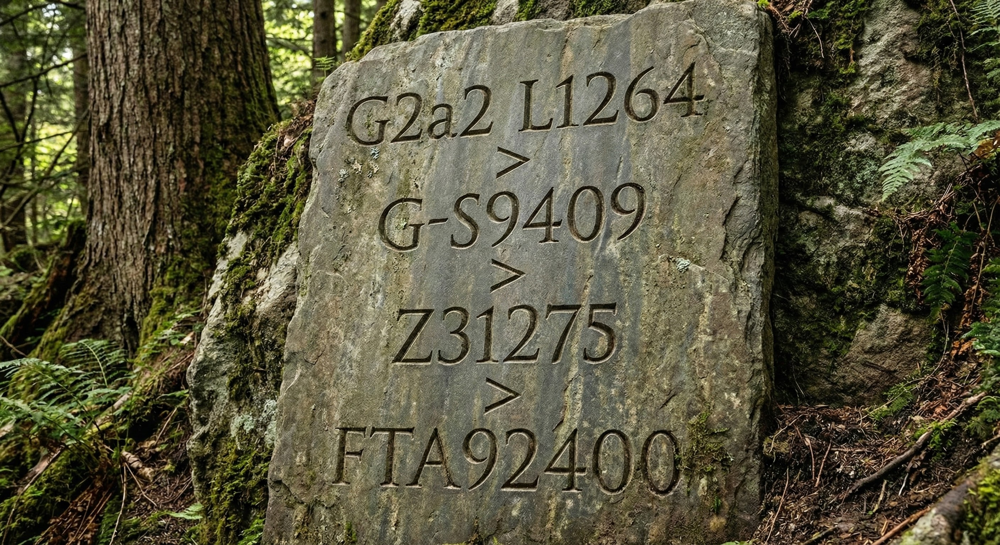

В прошлой главе мы сказали, что у тебя есть генетический адрес. Но это не просто "почтовый индекс". Это точная координата в истории.

### Аналогия: Система GPS-зумирования

Представьте, что вы смотрите на карту Земли через спутник. Вы начинаете издалека и постепенно приближаете камеру.

**Уровень 1. Континент (Гаплогруппа)**
*   *Код:* **G**, **R**, **J**
*   *Масштаб:* Десятки тысяч лет.
*   *Суть:* Это как сказать «Я с Евразии». Это верно, но слишком обще. Люди с гаплогруппой G живут и в Португалии, и на Кавказе, и в Иране. На этом уровне мы все — просто далекие «земляне».

**Уровень 2. Регион (Древний субклад)**
*   *Код:* **G-L1264**
*   *Масштаб:* 4000–5000 лет (Бронзовый век).
*   *Суть:* Вы приближаете карту. Теперь видно не весь мир, а конкретно Кавказские горы и побережье Черного моря. Все носители L1264 — это потомки одной популяции, жившей здесь в эпоху дольменов. Это уже ваш «город».

**Уровень 3. Улица (Глубокий субклад)**
*   *Код:* **Z44222** или **S9409**
*   *Масштаб:* 1000–1500 лет (Средневековье).
*   *Суть:* Зум еще ближе. Мы видим конкретные ущелья. Здесь жили предки адыгских и абхазских обществ. Это ваша «улица».

**Уровень 4. Номер дома (Терминальный снип)**
*   *Код:* Ваш уникальный ID (например, **FT12345**)
*   *Масштаб:* 200–500 лет.
*   *Суть:* Максимальное приближение. Это конкретный дом. Это ваша фамилия, ваш атаул. Сюда попадают только самые близкие.

### Ограничения: Карта — не территория

Важно понимать, где эта аналогия заканчивается.

1.  **Дом стоит, жильцы меняются.**
    Ваш генетический адрес (**G-L1264**) возник 4500 лет назад. За это время ваши предки могли сменить язык (с пра-кавказского на адыгский), религию (язычество → христианство → ислам) и самоназвание. ДНК хранит биологическую преемственность, но культура передается воспитанием, а не генами.
2.  **Адрес нельзя сменить.**
    В жизни можно переехать. В генетике — нет. Вы не можете "перейти" из гаплогруппы G в R. Это запись, высеченная в камне.

> [!TIP] 🖼️ **Иллюстрация 1: GPS Зум**
> 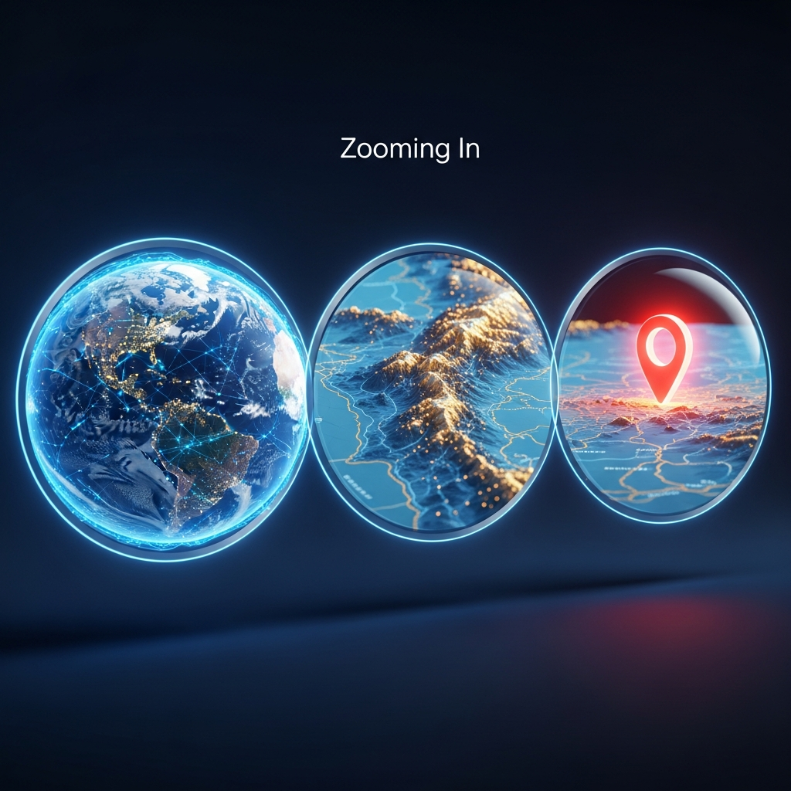
> *Слева: Планета (G). Центр: Регион (L1264). Справа: Точка на карте (Вы).*

### Карта и Компас: Кто попадает на древо?

> [!TIP] 🖼️ **Иллюстрация 2: Туман и Ясность (Компас vs Карта)**
> 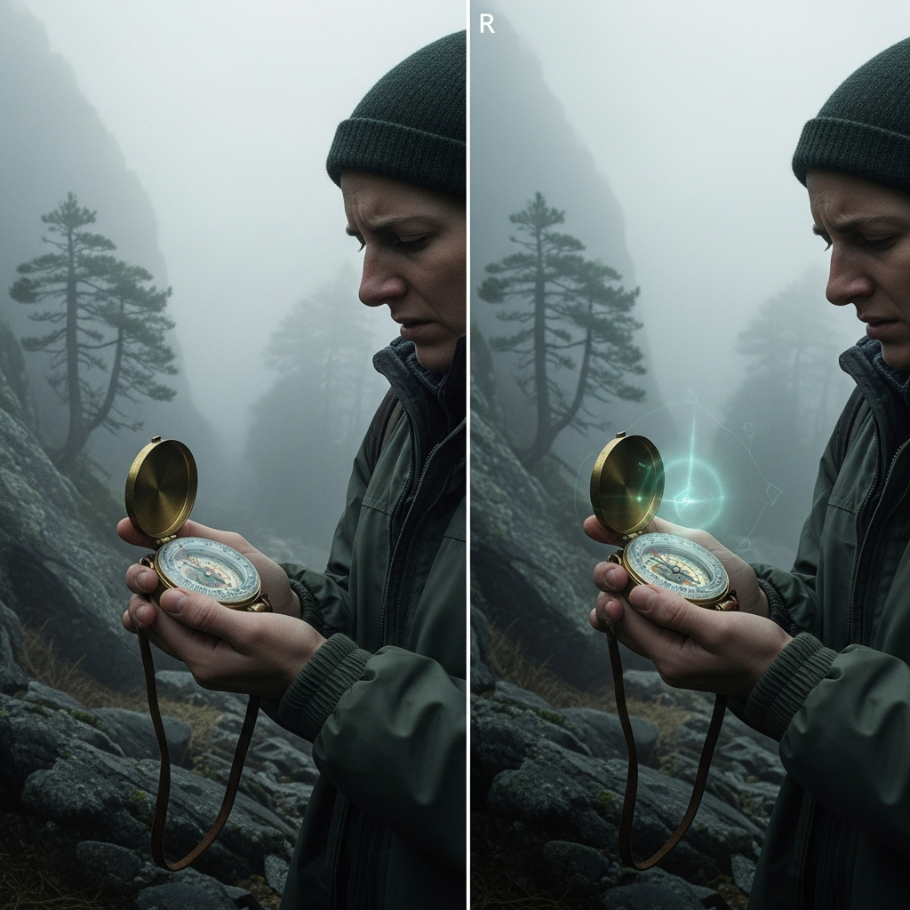
> *Слева: Обычный тест (Компас). Справа: WGS (Детальная карта).*


Прежде чем искать себя на YFull, важно понять одно правило.
**На глобальном древе видны только те, кто сдал «глубокий» тест (WGS или BigY).**

Представьте себе карту города.
*   **WGS/BigY (Глубокие тесты):** Вы — строитель карты. Ваш дом наносится на план с точностью до метра. Вы создаете новые улицы и переулки.
*   **Genotek / FTDNA Family Finder / 23andMe (Чиповые тесты):** Это «компас». Тест говорит вам: «Ты живешь где-то на севере города (Гаплогруппа G2a)». Но он не строит ваш дом на карте.

> [!WARNING]
> **Почему моего троюродного брата нет на древе?**
> Если ваш брат сдал обычный тест в Genotek за 10 тысяч рублей, **его не будет на древе YFull**.
> Он будет знать, что он ваш родственник (по аутосомам), но на схеме Y-хромосомы его ветка не появится, пока он не сделает апгрейд до WGS.
> Вы — на карте. Он — в «облаке» вокруг карты.

### Инструмент навигации: Интерфейс YFull

> [!TIP] 🖼️ **Иллюстрация 3: Расследование связей**
> 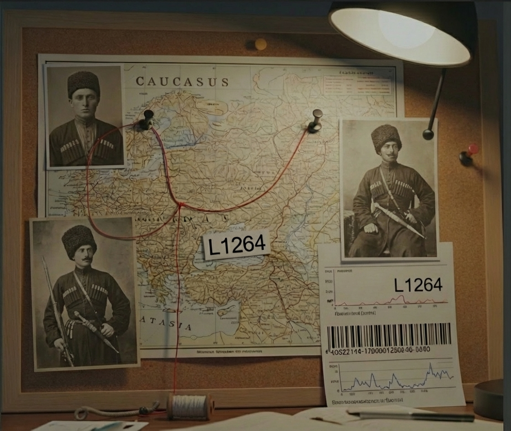
> *ДНК-генеалогия работает как детектив: мы соединяем карту, архивные данные и современные тесты.*


Сайт YFull может пугать обилием цифр. Давайте разберем «кабину пилота».

#### 1. Режим Древа (Tree Mode) — Самая важная кнопка
По умолчанию YFull открывается списком. Это неудобно.
**Сразу ищите кнопку `[ Tree ]` в верхней части экрана.**
Она превращает сухой список в понятную схему с ветками.

#### 2. Как читать дистанцию (Кто ближе?)

В режиме древа вы увидите структуру, похожую на папки в компьютере.

```
ВЕТКА (Ваш дедушка)
├── ВАШ ОТЕЦ
│   ├── ВЫ (id: YF12345) 🇷🇺
│   └── ВАШ БРАТ (id: YF67890) 🇷🇺
│
└── ДЯДЯ (Брат отца)
    └── ВАШ КУЗЕН (id: YF11111) 🇹🇷
```

**Правило близости:**
1.  **Общий узел:** Найдите точку, где ваши линии соединяются.
2.  **Считайте шаги:** Чем меньше шагов до развилки, тем ближе родство.
3.  **Возраст узла:** Смотрите на дату `TMRCA` (Time to Most Recent Common Ancestor) в узле соединения.
    *   TMRCA 100 лет = Прадед.
    *   TMRCA 500 лет = Средневековый предок.
    *   TMRCA 4000 лет = Бронзовый век.

#### 3. Правило Разных Гаплогрупп
Если у вас гаплогруппа **G**, а у соседа **R1a**, вам не нужно искать общие ветки.
**Вы не родственники.**
Ваши линии разошлись 45 000 лет назад. Это задолго до появления любых современных народов, фамилий и языков. Сравнивать ваши снипы бессмысленно. Вы просто соседи по планете.

### Алгоритм детектива: Как провести расследование

Вы открыли свою ветку. Вы видите свой ID. Что делать дальше?

**Шаг 1: Осмотрите соседей (География)**
Посмотрите на флаги рядом с ID других людей в вашей ветке.
*   Видите 🇹🇷 (Турция), 🇯🇴 (Иордания), 🇸🇾 (Сирия)? Это потомки мухаджиров. Ваша родня, уехавшая в XIX веке.
*   Видите 🇭🇺 (Венгрия) или 🇦🇹 (Австрия)? Возможно, это след средневековых миграций алан или древних мадьяр.

**Шаг 2: Взгляд в прошлое (TMRCA)**
Посмотрите на цифру в узле, который объединяет вас с соседом.
*   `400 ybp` (лет назад)? Вы разделились недавно. Ищите общую фамилию.
*   `3900 ybp`? Это древнее родство. Вы потомки одного племени бронзового века, но ваши фамилии давно разные.

**Шаг 3: Шаг назад (Zoom Out)**
Если вы одни в своей ветке (уникальный терминальный снип), поднимитесь на уровень выше (нажмите на название родительской ветки).
Кто там? Какие там страны?
*   *Пример:* Вы один в `FT123`, но в родительской `Z44222` много людей из Кабарды. Значит, вы — часть большого адыгского клана, просто ваша личная «веточка» пока редкая.

**Шаг 4: Поиск Древней ДНК
Иногда на древе встречаются особые значки с пометкой `ancient`.
Это  древние образцы из археологических раскопок.
*   Нажмите на `[age]` рядом с образцом, так можно увидеть возраст этих останков.
*   Если такой образец находится в вашей ветке — поздравляем! Вы прямой потомок человека из этой археологической культуры. Вы только что доказали, где жили ваши предки тысячи лет назад.

> [!TIP]
> **Ваше расследование — это марафон.**
> Древо растет каждый день. Если сегодня вы "сирота" на ветке — через месяц может появиться «брат».
> Сохраните ссылку на свою ветку и проверяйте её раз в месяц. История пишется прямо сейчас.

---
## Глава 2. Как растёт древо

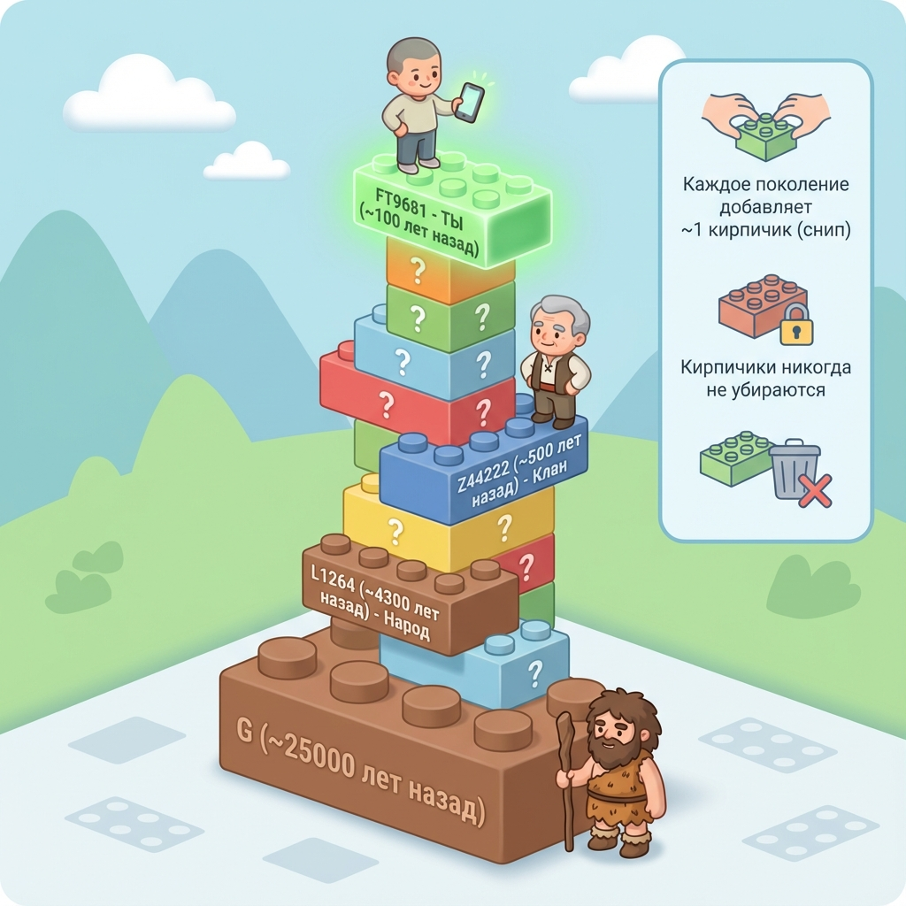

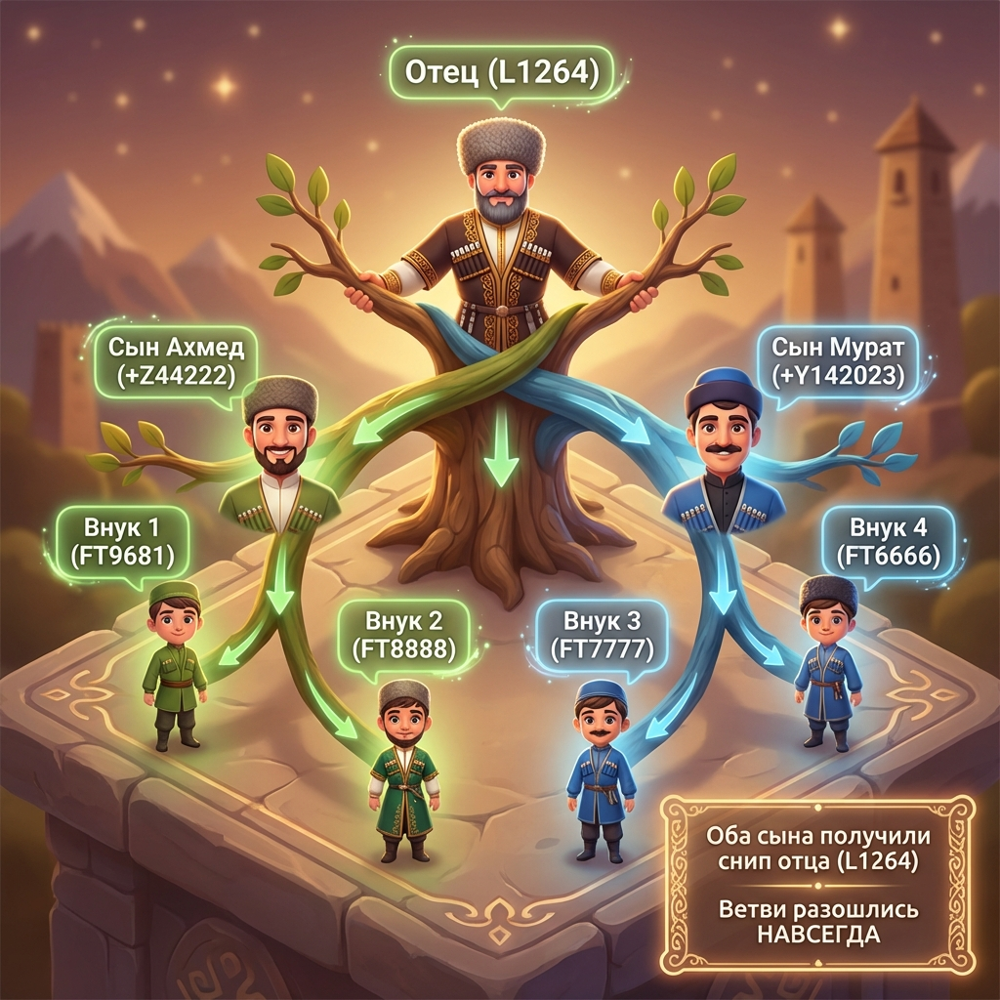

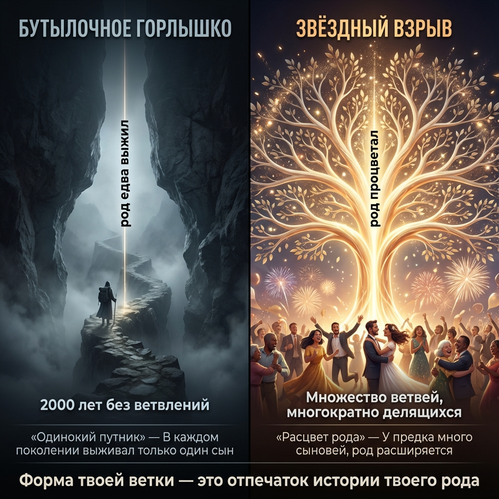

Ты уже умеешь читать свой адрес. Теперь разберёмся, откуда он берётся и что означают даты.

### Аналогия: Кирпичики

> [!TIP] 🖼️ **Иллюстрация: Рост Древа**
> 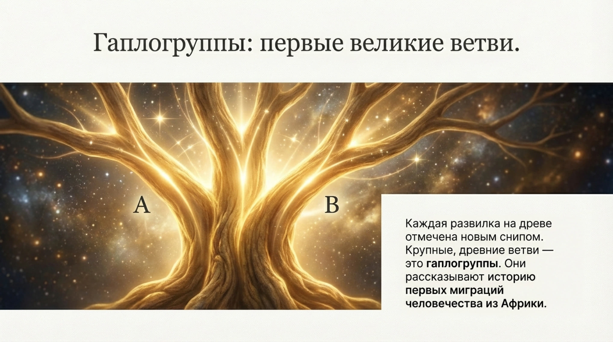

> [!TIP] 🖼️ **Иллюстрация 4: Кубики и Башня**

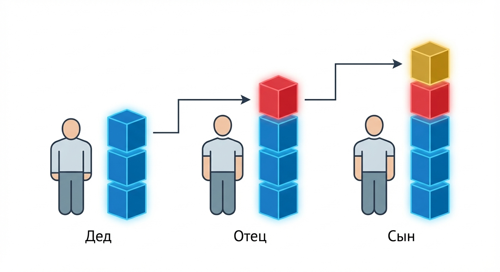


Представь, что каждый мужчина строит башню из кубиков.
1. Отец передаёт сыну свою башню целиком.
2. Сын кладёт сверху **один новый кубик** — свою уникальную метку.
3. Внук получает башню отца и кладёт ещё один кубик.

Эти «кубики» — **снипы** (SNP, мутации). Они остаются навсегда и никогда не исчезают.

### Как разветвляется древо

> [!TIP] 🖼️ **Иллюстрация 5: Развилка (Ветвление)**

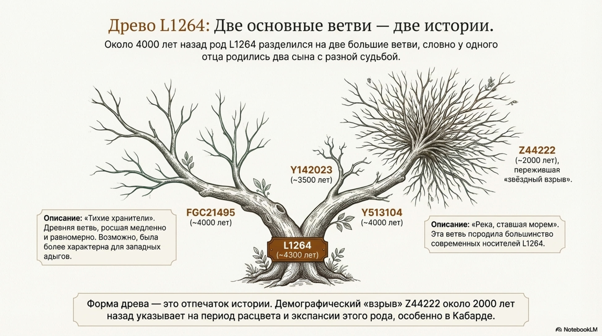


Допустим, у первопредка **L1264** (жил ~4400 лет назад) родилось два сына.
- Оба сына получили **метку** отца (**L1264**).
- Один сын добавил свою уникальную метку: **FGC21495**.
- Другой сын добавил свою уникальную метку: **Y513104**.

Теперь это две разные ветви. Потомки FGC21495 **никогда** не получат код Y513104. Ветви разошлись навсегда.


> [!TIP] 🖼️ **Иллюстрация 6: Детализация разрыва (Туман)**
> Наглядная схема того, как образуется разрыв между возрастом ветви и общим предком.
> 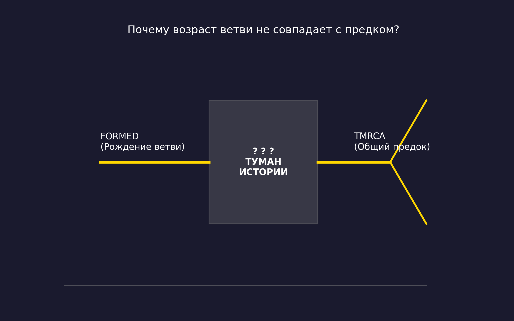
### Самое важное: Formed и TMRCA

Эти две даты — ключ к истории вашего выживания.

**1. Formed (Дата разделения)**
Это момент, когда ваш род отделился от большого ствола.
Представьте двух братьев 4000 лет назад. Один ушел на запад, другой (ваш предок) остался на Кавказе.
*   В этот момент появилась ваша уникальная метка.
*   **Formed** фиксирует это историческое событие. Это дата рождения вашей *ветки*.

**2. TMRCA (Дата общего предка)**
Это время жизни ближайшего дедушки, от которого происходят все, кто **сейчас** сдал тест в этой группе.

---

### Почему эти даты часто не совпадают?

Вы спросите: *"Если ветка родилась 4000 лет назад, почему наш общий предок жил всего 500 лет назад? Где мы были 3500 лет?"*

Здесь работают два фактора.

**1. Угасшие линии (Тупики)**
У наших далеких предков, безусловно, были братья. Но не все рода выживают. Войны, эпидемии, отсутствие сыновей — многие линии просто пресеклись за тысячи лет.

**2. Скрытые родственники (Туман)**
Это самое главное. Скорее всего, потомки этих "пропавших" братьев живы! Они живут рядом с нами — в Нальчике, Сухуме, Майкопе или в диаспоре. Но они **еще не сдали тест**.

Пока их нет в базе, мы их не видим. Нам кажется, что 3500 лет была пустота, но на самом деле это просто "неисследованная территория".

> [!IMPORTANT]
> **Ваша миссия — заполнить пустоту.**
> Каждый новый участник может оказаться потомком такой "древней" боковой ветки.
> Если он сдаст тест, он может "встать" посередине этого гигантского разрыва. Вместо одной линии длиной 3500 лет мы увидим две ветки по 1500 лет.
>
> **Древо не пустое — оно просто недописанное.** Чем больше людей мы тестируем, тем древнее и детальнее становится наша общая история.

> [!TIP] 🖼️ **Иллюстрация 7: Туман Истории (Formed vs TMRCA)**

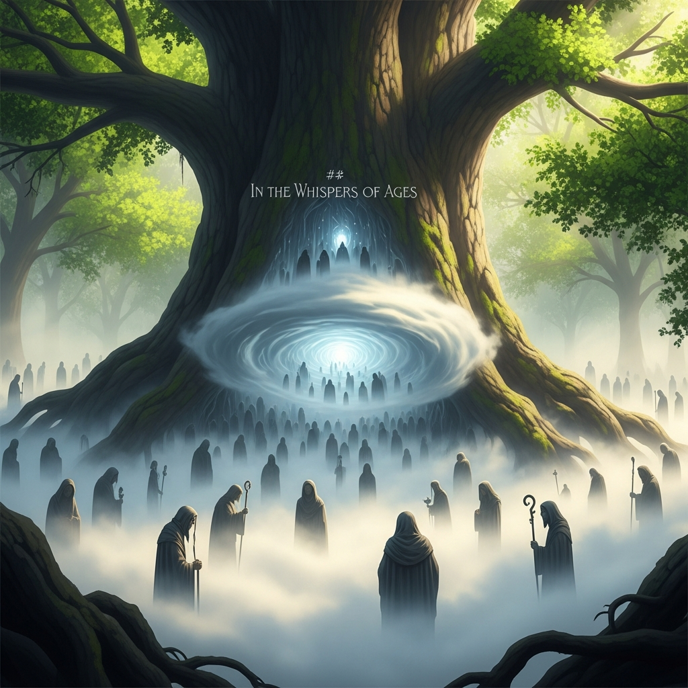


**Итог:**
*   **Formed** — когда началась история ветви.
*   **TMRCA** — та часть истории, которую мы *уже успели найти*.

---

## Глава 3. Женская линия (mtDNA)

У каждого мужчины есть **второй адрес**.

Y-хромосома приходит от отца. Но есть еще **митохондриальная ДНК (мтДНК)** — маленькая, но важная часть генома, которая передается только **от матери**.

### Как это работает?
1.  **Мама передает свою мтДНК всем детям:** и сыновьям, и дочерям.
2.  **Дочери передают её дальше** своим детям.
3.  **Сыновья (мужчины) получают её, но дальше не передают.** На мужчине эта линия обрывается. Его дети получат мтДНК уже от своей матери.

Получается, ваша мтДНК — это прямая линия:
`Вы ← Мама ← Бабушка (по маме) ← Прабабушка (по маме)...`

### Медленные часы
В отличие от Y-хромосомы, женская линия мутирует очень медленно.
Если у вас полное совпадение с другим человеком по мтДНК, ваш общий предок мог жить как **300 лет назад**, так и **2000 лет назад**.
Поэтому мтДНК редко используют для поиска близкой родни (фамилии), но она незаменима для понимания **глубоких корней**. Она показывает, откуда пришли женщины вашего рода тысячи лет назад.

### Ваш тест (WGS) — это Full mtGenome
Обычные тесты часто смотрят только кусочек этой линии. Вы же сдали WGS, а значит, у вас прочитан **весь** круг митохондриальной ДНК.
Это позволяет строить такие же точные древа, как и для мужчин. На YFull для этого есть отдельный сервис — **MTree**.

> [!TIP] 🖼️ **Иллюстрация 8: Полный круг (WGS vs Обычный тест)**


---

## Глава 4. Поиск родственников (Аутосомы)

> [!TIP] 🖼️ **Иллюстрация 9: Аутосомы vs Y-ДНК**


У тебя есть адрес (Y-ДНК) — это твой прямой отцовский род. Это **стальной стержень**, который пробивает толщу веков и точно связывает тебя с первопредком. Он никогда не прерывается и не размывается.

**Аутосомы** — это вся остальная твоя ДНК, окружающая этот стержень. Это мозаика, собранная от **всех** предков: мамы, папы, всех бабушек и дедушек с обеих сторон.

Аутосомный тест позволяет найти родственников (троюродных, четвероюродных братьев и сестёр) по **всем** линиям за последние 200–300 лет.

> [!WARNING]
> **Слепая зона аутосом**
> В отличие от Y-ДНК, аутосомы не имеют «бирок». Тест покажет вам человека и скажет: *«Это твой троюродный брат»*.
> Но тест **не скажет**, с какой стороны: по папе, по маме или через прабабушку.
>
> Чтобы это понять, нужна **традиционная генеалогия**. Вы должны знать имена, фамилии и села своих предков до 4-5 колена. Только сравнив свои записи с записями найденного родственника, вы поймете, по какой линии вы совпали.
>
> **ДНК находит человека. Генеалогия объясняет, кто он.**

### Где искать родственников?

> [!TIP] 🖼️ **Иллюстрация 10: Где искать родственников?**
> 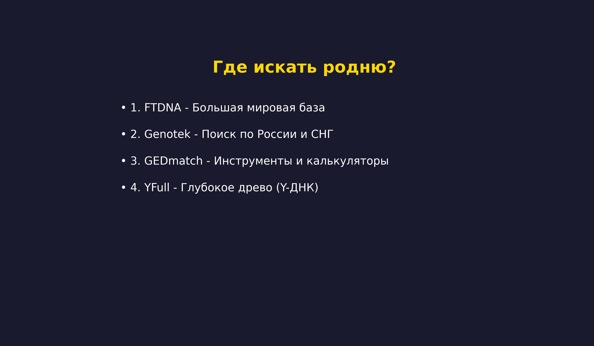


Для жителей Кавказа и России приоритеты отличаются от общемировых.

#### 1. FTDNA (Family Finder)
**Статус:** Обязательно.
У этой лаборатории самая большая база, в которую годами загружались кавказские проекты. Здесь больше всего шансов найти совпадения среди диаспоры (Турция, Ближний Восток, США) и земляков, кто сдавал тесты давно.
*   **Что делать:** Если вы сдавали WGS, вы можете извлечь аутосомный файл и загрузить его **бесплатно** в FTDNA. Вы сразу увидите список совпаденцев.
*   **Этнический состав:** За дополнительную плату (~19$ или 9$ по акции) можно разблокировать отчет. Для нашего региона он показывает общие категории: «Западный Кавказ», «Южный Кавказ» (без деления на народы). Но если у вас в недавнем прошлом был предок, например, славянского или европейского происхождения, это будет сразу заметно.

#### 2. Genotek
**Статус:** Обязательно.
Крупнейшая российская база. Если ваши родственники живут в России (КБР, КЧР, Адыгея, Краснодарский край, Москва) и сдавали тест недавно — они скорее всего в Genotek. FTDNA сейчас сложнее оплатить из РФ, поэтому поток новичков идет сюда.
*   **Что делать:** Загрузите свой файл в Genotek (cтоит недорого при загрузке сторонних данных).
*   **Здоровье и Таланты:** Это сильная сторона Genotek. Загрузив свой WGS, вы можете (за отдельную плату) получить детальные отчеты, которые недоступны в других местах: риски заболеваний, переносимость лекарств, реакция на продукты, спортивные способности и таланты.

#### 3. GEDmatch
**Статус:** Инструмент для профи.
Это бесплатная открытая база. Людей с Кавказа здесь меньше, чем в FTDNA или Genotek, но у неё есть уникальные плюсы:
*   Она принимает данные из всех лабораторий.
*   Здесь есть мощные инструменты для анализа («калькуляторы» этносов).
*   Здесь можно найти «потеряшек», кто сдал тест в одной фирме, а вы в другой, и вы бы никогда не встретились.
*   **Мухаджиры:** Многие потомки адыгов за рубежом загружают данные именно сюда.

### Главное правило
> *Тест, которого нет в базе — это письмо, которое не отправили.*

Загрузитесь **везде**. FTDNA и Genotek дадут вам массовость. GEDmatch даст инструменты и шанс найти редкие связи. Не ограничивайте себя одной базой.
---

# Часть 2. Технические детали

## Глава 5. Файлы и технические детали

### Что происходит «под капотом»?

Результат вашего теста — это не просто бумажка с гаплогруппой. Это гигантский объем данных. Чтобы вы понимали масштаб, вот как выглядит процесс обработки:

**1. FASTQ (Сырой песок)**
Секвенатор читает вашу ДНК кусочками и выдает огромные файлы с миллиардами коротких фрагментов кода.

**2. BAM (Цифровая копия)**
Специальные программы собирают эти кусочки в единую цепь, сравнивая с эталоном человека. Получается файл **BAM**.
*   **Размер:** от 40 до 300 ГБ.
*   **Суть:** Это ваша полная цифровая копия. Именно в этом файле хранится всё: цвет глаз, риск болезней, история предков.

> [!NOTE]
> Работать с такими гигантами сложно. Обычные сайты (вроде FTDNA или Genotek) просто «поперхнутся», если вы попытаетесь скормить им 100 ГБ данных. Поэтому из большого файла мы изготавливаем «выжимки» для конкретных задач.


> [!TIP] 🖼️ **Иллюстрация 11: Сравнение точности (STR Маркеры)**
> Сравните разрешение обычных тестов (Yfiler) и современного WGS. Чем больше маркеров, тем четче портрет предка.
> 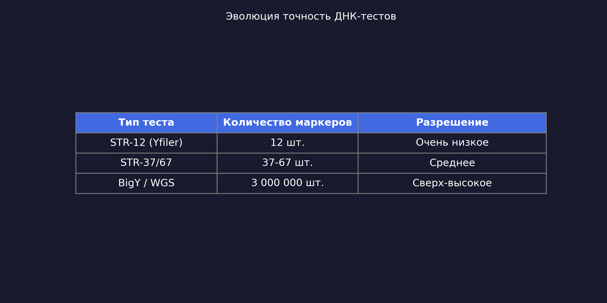
### Рабочие файлы (Инструменты)

Именно эти файлы используются для загрузки на сайты:

1.  **Y и Mito файлы:** Извлекаются специально для профессионального анализа на **YFull**. Это «мужская» и «женская» книги вашей истории.
2.  **Аутосомный файл (формат 23andMe v5):**
    Это текстовый файл, который весит всего 15-30 МБ.
    *   *Зачем он нужен:* Это универсальный формат, который понимают все популярные сайты (Genotek, FTDNA, GEDmatch, MyHeritage).
    *   *В чем подвох:* В этот файл попадает лишь крошечная часть вашего генома (около 0.02%), потому что эти сайты заточены под простые и дешевые тесты ("чипы"). Они просто не умеют читать больше.

### Аналогия: Земельный участок

> [!TIP] 🖼️ **Иллюстрация 12: WGS — Вся земля ваша**
> 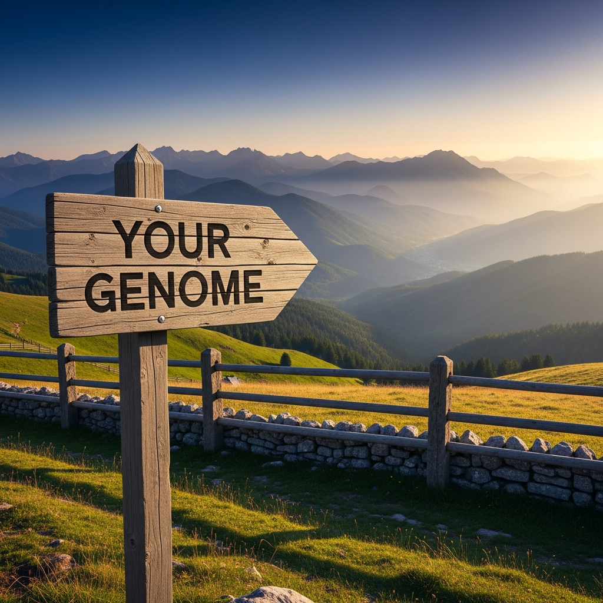


Зачем тогда делать дорогой WGS, если сайты используют только маленькую часть?

> [!TIP]
> **Представьте, что вы купили огромный участок земли.**
>
> *   **Обычный тест** — это как купить право построить маленькую бытовку и больше ничего.
> *   **Ваш тест WGS** — это покупка **всей земли** в собственность.
>
> Сейчас, загружая файлы на FTDNA или Genotek, вы строите на своем участке "маленький домик" (поиск родни). Но у вас остались гектары свободного пространства!
>
> В будущем вы сможете:
> *   Построить "клинику" (проанализировать гены заболеваний).
> *   Построить "архив" (найти новые данные, когда наука шагнет вперед).
>
> Вам не придется докупать землю. У вас уже всё есть.

### Медицина и будущее
Полногеномный файл уже сейчас используют для серьезных медицинских консультаций. Есть базы данных (например, Prometheus или научные ресурсы), где можно проверить свои риски. Это требует навыков, но данные у вас уже "в кармане". Это ваш задел на всю жизнь.

---

# Часть 3. История ветвей

> [!TIP] 🖼️ **Иллюстрация 13: Древо AADNA**

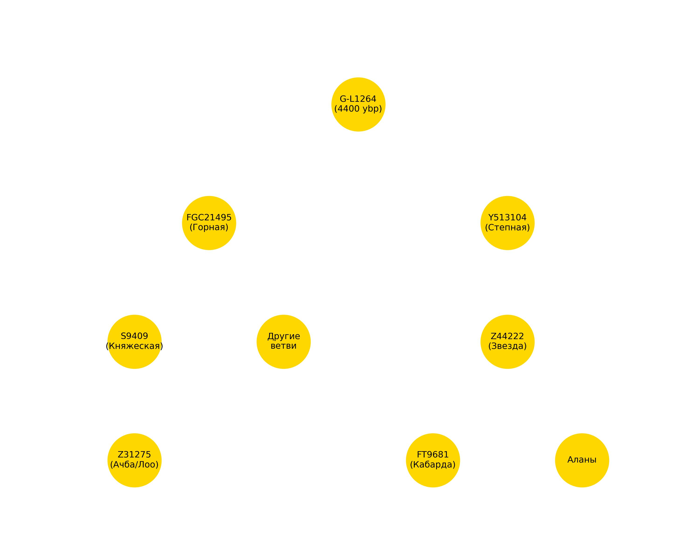


## Генетический ландшафт Кавказа

Прежде чем изучать свою ветку, нужно понять масштаб карты.

### Гаплогруппа — это "Континент"

Самое первое и грубое деление — это гаплогруппа (первая буква: G, J, R, E).
*   **Разные буквы = Нет родства.** Если вы **G**, а ваш однофамилец **R**, то ваш общий предок жил ~45 000 лет назад. Это полностью исключает близкое родство. Можно даже не копать глубже.
*   **Одна буква ≠ Родственники.** Это самая частая ошибка новичков.

### Ловушка похожих названий

Многие думают: *"Я G2a1, а сосед G2a2. Мы почти братья!"*
На самом деле между этими ветками — **пропасть в ~15 000 лет**.
Это как сказать, что русский и индус — близкие родственники, потому что оба говорят на индоевропейских языках.
Чтобы найти реальное родство, нужно смотреть не на заголовок (G2a), а на "мелкий шрифт" (терминальные коды).

### Особенности основных групп на Кавказе

**1. G2a (Запад и Центр: Две большие разницы)**

> [!TIP] 🖼️ **Иллюстрация 14: G2a — Великий Каньон**

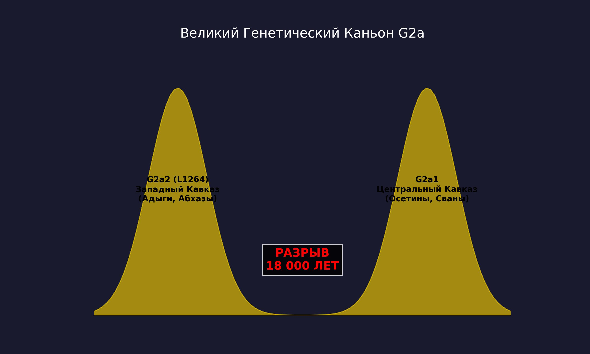


Эта группа доминирует на Западном (адыги, абхазы) и Центральном (осетины, сваны) Кавказе. Но внутри это два разных мира:
*   **Запад (Адыги, Абхазы):** Здесь царит ветвь **G2a2** (в основном L1264). Это древний массив (~5000 лет), который плавно растет здесь с эпохи бронзы.
*   **Центр (Осетины, Сваны):** Здесь доминирует **G2a1**. У сванов это древние линии, а у осетин — огромный, но очень "молодой" кластер (всего ~1000 лет), возникший из-за резкого вымирания и последующего демографического взрыва одной семьи в средневековье.
*   **Важно:** Между  G2a2 и  G2a1 — пропасть в ~**18 000 лет**. Несмотря на общую букву G, они генеалогически очень далеки.

**2. J2a (Зонтичный бренд)**

> [!TIP] 🖼️ **Иллюстрация 15: J2 — Зонтичный бренд**

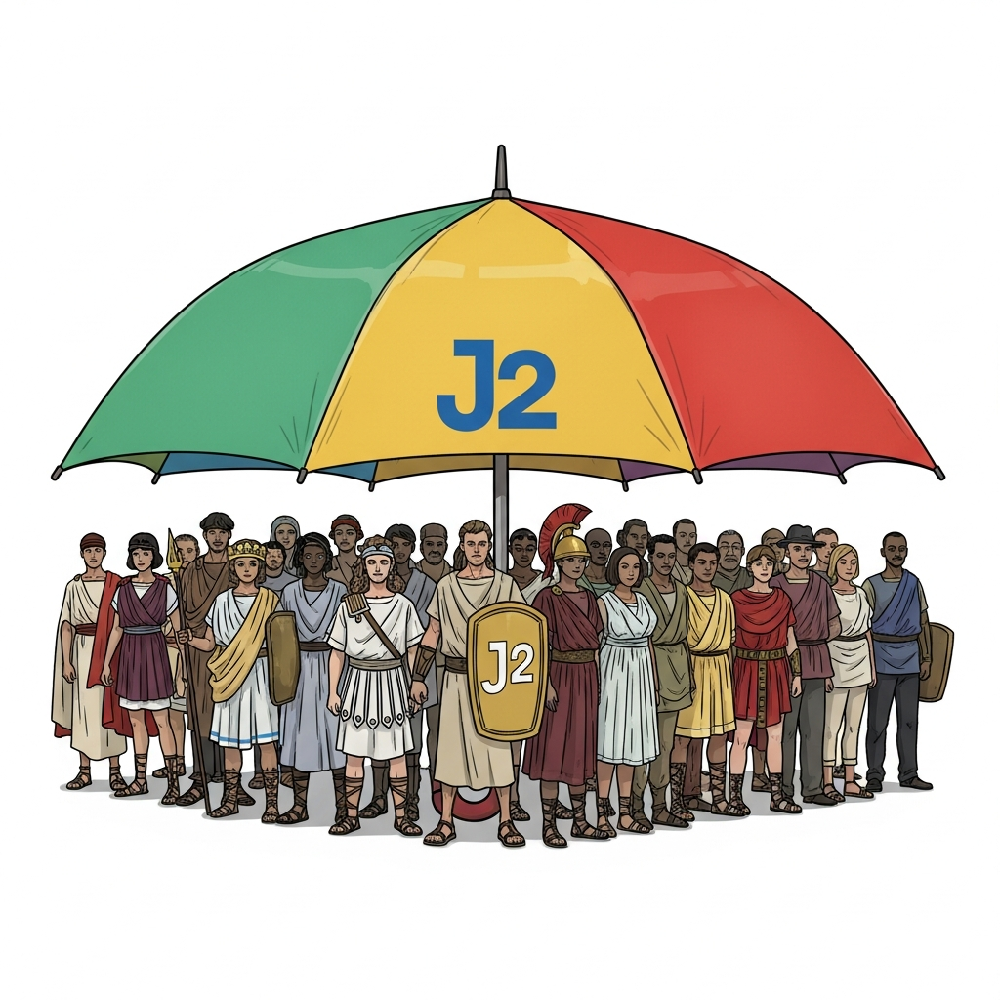


Очень сложная группа. Под вывеской "J2" скрываются десятки совершенно разных линий, между которыми может быть **15-20 тысяч лет** разницы.
*   **Древние автохтоны:** Некоторые линии живут на Кавказе более 10-12 тысяч лет. Например, знаменитая ветка "Kotias" (SK1313) или линии, найденные в Майкопской культуре (Y308111).
*   **Вайнахский кластер:** У чеченцев и ингушей J2 занимает огромную долю, но это совсем другая история — в основном это ветка **M67** > Y3612 и её потомственные линии.
*   **Вывод:** Если у вас J2, вам критически важно знать свой глубокий субклад. Просто "J2" не говорит почти ни о чем — вы можете быть потомком майкопского вождя или родственником вайнахского тайпа, и это будут разные миры.

**3. R1a и R1b (Молодые экспансии)**
В отличие от кавказских G и J, эти ветви на Кавказе часто представлены более "компактными" и молодыми кустами. Для R1a и R1b характерны "взрывные" расширения в эпоху бронзы (4000-5000 лет назад).

**R1a:** Имеет две массовые линии.
*   **Z282:** В основном восточно-европейская ветвь. На Кавказе встречается реже.
*   **Z93:** Связана с индо-иранскими народами. Заметно чаще встречается на Кавказе, особенно у кабардинцев и карачаево-балкарцев.

**R1b:** Самая массовая гаплогруппа в Западной Европе.
*   На Кавказе картина иная: здесь чаще встречается ветвь **L584**, которой в Европе заметно меньше.
*   Существуют специфические линии, массово представленные у осетин, балкарцев и некоторых дагестанских народов.

**4. Редкие группы (L, Q, E, T)**
Иногда встречаются ветви (например, L-L595), которые живут на Кавказе очень давно, но просто "не размножились".
Это не значит, что они пришельцы. Это могут быть **реликтовые линии** автохтонов, которые в силу случайностей истории остались малочисленными, пока соседние рода (G2a) заполонили всё вокруг. Быть редким — значит, возможно, хранить самую древнюю тайну.

---

> [!TIP] 🖼️ **Иллюстрация 16: Временная шкала (Timeline)**

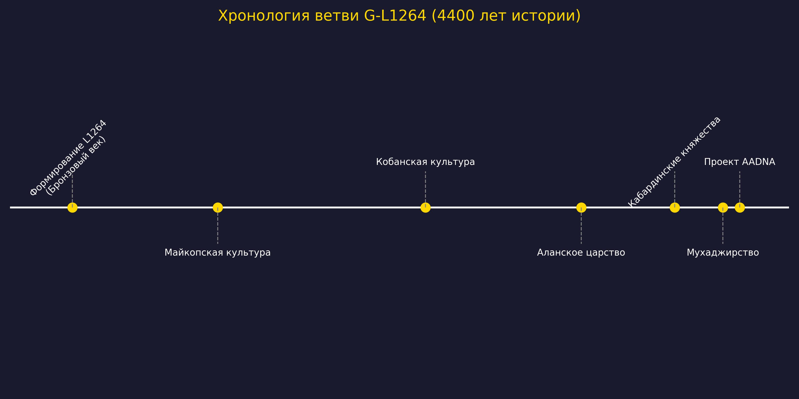


В этом разделе мы разберём историю основных ветвей, к которым принадлежит большинство участников проекта AADNA.

## Обзор ветки G-L1264: От Кавказа до Европы

**G-L1264** (филогенетически G2a2b2a1a1b1) — это ключевой маркер автохтонного населения Северо-Западного Кавказа.

*   **Возраст:** Ветвь сформировалась около **4800 лет назад** (конец III тыс. до н.э.), что совпадает с финалом Майкопской культуры и климатическими изменениями бронзового века.
*   **География:** Это доминирующая линия у западных адыгов (особенно шапсугов — до 80%!), абхазов и абазин. Однако её следы ведут далеко за пределы Кавказа — в Венгрию, Австрию и Поволжье.

### Древние ДНК: Свидетели истории

Мы не просто гадаем о прошлом. У нас есть физические доказательства — останки людей, живших тысячи лет назад, чей ДНК-тест совпал с вашим.

1.  Железный век: Скифы и Сарматы (Степь)**
Часть носителей L1264 покинула горы и влилась в мир кочевников.
*   **Kolbino 36 (375–350 до н.э., Воронеж):** Скифский воин. Прямое доказательство связи кавказцев со скифским миром.
*   **Rákoscsaba 211 (100–300 н.э., Венгрия):** Сармат. Показывает, как далеко на запад ушли потомки кавказских горцев вместе с сарматскими ордами.

**3. Великое переселение народов: Гунны и Авары (Европа)**
Самые удивительные находки сделаны в центре Европы. Кавказские (аланские) отряды ушли с гуннами и аварами на запад.
*   **Fonyód 4 (400–500 н.э., Венгрия):** Гуннское время.
*   **Goldenen Stiege (600–800 н.э., Австрия):** Целая группа воинов (образцы 145, 18, 197, 21, 303, 314) из элитного аварского могильника.
*   *Значение:* Если у вас есть совпаденцы из Венгрии или Австрии — это не случайность. Это эхо походов эпохи Великого переселения народов.
---
## G-S9409: Древняя аристократия

> [!TIP] 🖼️ **Иллюстрация 17: Глубокий анализ ветвей**
> Пример того, как глубокие снипы позволяют разделить даже близкие дворянские рода.
> 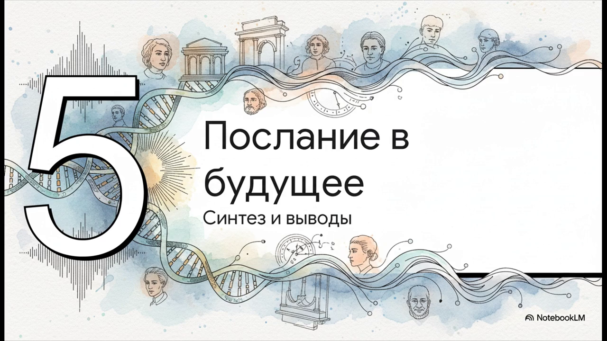

**Возраст:** Образовалась ~3900 лет назад.
**Общий предок (TMRCA):** ~3800 лет назад.

Внутри широкой древней ветви FGC21495 выделяется крупный кластер **S9409**. Это древняя линия, которая широко представлена среди абхазов и абазин.

**Кто здесь находится:**
Внутри этого древнего массива выделяется ветвь **Z31275**, которая разделяется на две знаковые линии:
1.  **FTA56892 (~1000 лет):** Княжеский род **Ачба (Анчабадзе)**. Объединяет ветви Ҭархан-иԥацәа и Амлез-иԥацәа.
2.  **FTA92400 (~750 лет):** Абазинские княжеские роды **Лоовы (Лоу)**, **Бибердовы**, **Дударуковы**, **Клычевы**, а также связанные с ними дворянские фамилии.

> [!IMPORTANT]
> Эти данные подтверждают предания об общем происхождении абазинских и абхазских аристократических родов от одного предка, жившего примерно в IX-X веке (эпоха Абхазского царства). Не все носители старшей ветви S9409 — князья, но именно **Z31275** является маркером этой династической общности.

**История:**
Данные YFull показывают, что общий предок конкретно этого "княжеского" блока (снипы FTA56546, FT364858) жил примерно **1000–1300 лет назад**. Это совпадает с периодом расцвета Абхазского царства и формирования феодальной структуры.

---
## G-Y513104: Река, ставшая морем (Степной вектор)

**Возраст:** Образовалась ~4400 лет назад.
**Общий предок (TMRCA):** ~3900 лет назад.

В отличие от "горной" братской линии FGC21495, эта ветка проявила невероятную мобильность. Её носители активно участвовали в жизни Степи — от Хазарского каганата до Золотой Орды.

### 1. G-Z44222: "Звезда Кабарды" и Аланы

> [!TIP] 🖼️ **Иллюстрация 18: Карта "Звезда Кабарды"**


Самая массовая и "взрывная" ветвь (TMRCA ~3900 лет).

**Интересные снипы внутри:**
*   **FT9681:** Важная подветвь внутри Z44222. Многие участники проекта попадают именно сюда. Несмотря на то, что сама мутация древняя, её активное разветвление в наших данных часто указывает на более близкое родство в пределах последних столетий (феодальная Кабарда).

---
## R1a (Z93): Степная аристократия

> [!TIP] 🖼️ **Иллюстрация 19: Схема R1a**

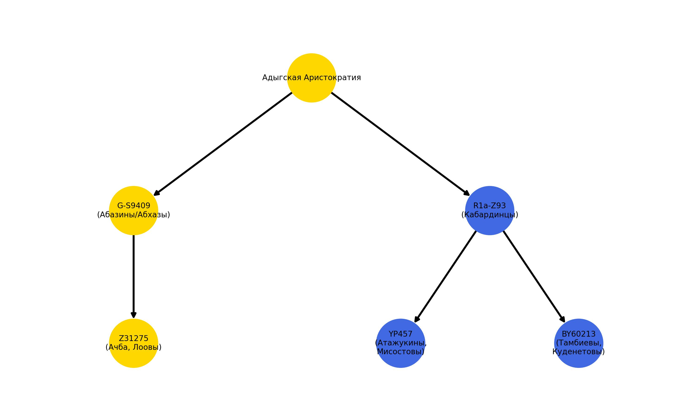


Это не просто "еще одна гаплогруппа". Это генетическое эхо Аланского царства.

Большая часть кабардинских линий R1a относятся к особому "азиатскому" субкладу **R-Y934**.
*   **Древность:** Эта линия была маркером **Срубной культуры** (бронзовый век), а затем скифов и сарматов.
*   **Синхронность:** Обе главные ветви (см. ниже) "взорвались" в росте одновременно — около **300** - **500 года н.э.** Это время становления Алании после гуннского нашествия.

### 1. R-YP451 >> YP457 (Ветка Князей) (TMRCA 1400 лет.)
Эта линия наиболее массово представлена среди высшей аристократии Кабарды.

*   **Кто здесь:** Верховные князья Кабарды (**Атажукины, Мисостовы, Жамботов итд.)

### 2. R-BY60213  (TMRCA 1700 лет.)
Вторая мощная ветвь, уникальная для региона.

*   **Фамилии:** Тамбиевы, Болотоковы, Исламовы итд.
*   **История:** Вероятно, это следы другой аланской племенной группировки, которая вошла в состав кабардинского этноса на правах сословия уорков (дворян).

### Важно: R-Z93 vs R-Z280
Не путайте свои результаты!
*   **R-Z93 (Y934):** Древняя степная, "аланская", аристократическая.
*   **R-Z280:** Европейская ветвь. На Кавказе встречается реже. Это может быть следом более поздних контактов  или очень древних связей с катакомбной культурой. Но она не образует таких мощных княжеских кластеров.

> [!IMPORTANT]
> **Эффект элитного доминирования**
> Почему степная Y-хромосома сохранилась в горах? Адыгская знать (пши-уорк) практиковала строгую эндогамию (браки только "своих со своими"). Это законсервировало гены отдельных линий внутри высшего сословия, не давая им раствориться.

---
### Если у тебя редкая ветвь

**«Я получил результат, и я не L1264. Я не местный?»**

Это огромная ошибка. Комплексовать из-за «редкой» гаплогруппы — значит не понимать суть генетики.

1.  **Редкий — значит ценный.**
    Если у вас распространенная ветвь (как L1264), вы — один из тысяч. Ваша история хорошо изучена. Но если у вас редкая для Кавказа линия (например, редкие ветви J2, J1, E1b, R1b или другие ветви G2a), **вы — носитель уникальной информации**. Возможно, ваш род сохраняет генетическую память о древних миграциях, о которых молчат учебники истории. Вы открываете новую главу.

2.  **Этнос ≠ Гаплогруппа.**
    Народ формируется тысячелетиями. Адыги и абхазы — это сплав множества древних племён: автохтонов Кавказа, выходцев из Малой Азии, степняков. Каждый род внёс свой вклад в культуру и генофонд. Без «редких» ветвей картина была бы неполной.

3.  **Вы можете оказаться древнее «местных».**
    Иногда «редкая» ветвь оказывается следом самого древнего, до-майкопского населения, которое жило здесь ещё до прихода носителей массовых гаплогрупп.

**Гордитесь своим результатом. Он делает общую картину богаче.**

---
> [!TIP]
> **Ваш результат — это тоже история.**
> Возможно, через 100 лет ваши потомки будут читать о вашем тесте как о ключевом моменте, который сохранил историю семьи.
> 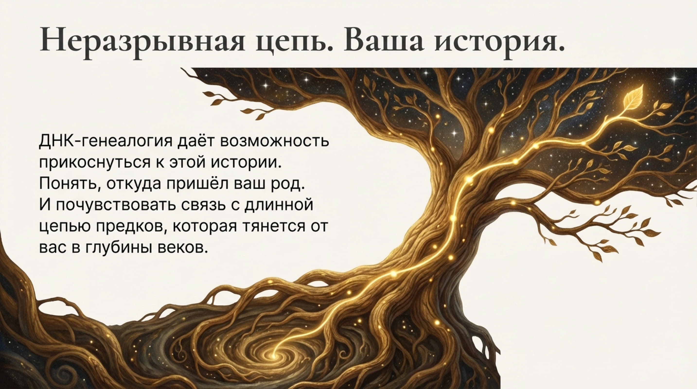


---
# Часть 6. Справочник

## FAQ: Частые вопросы

> [!TIP] 🖼️ **Иллюстрация**
> 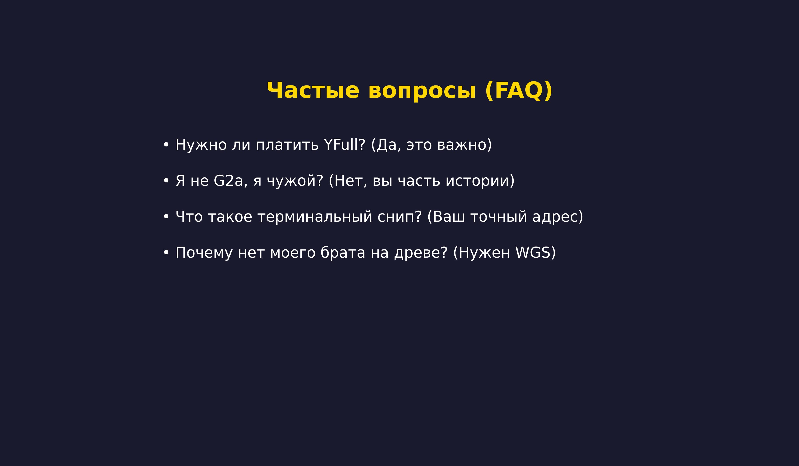


**В: Обязательно ли платить YFull 49$?**
О: Очень рекомендуется. Без этого ваши данные Y-хромосомы не попадут в общее древо, и вы не узнаете свой точный возраст ветвей и TMRCA с другими участниками.

**В: У меня не G2a, а R1a (или J2, или другая). Я не местный?**
О: Вы местный. Этногенез (формирование народа) — сложный процесс. Адыго-абхазские народы сформировались из смешения разных родов тысячи лет назад. Каждая гаплогруппа — это часть нашей общей истории. Например, J2 часто встречается у абхазов, R1a — у некоторых черкесских родов.

**В: Что такое терминальный снип?**
О: Это самый молодой "кубик" в вашей башне ДНК. Ваш уникальный генетический адрес на данный момент.

## Глоссарий терминов

> [!TIP] 🖼️ **Иллюстрация**
> 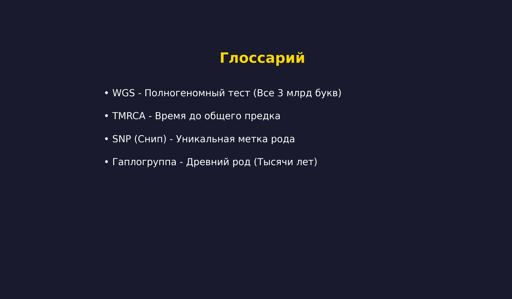


*   **BAM (CRAM)** — файл с полными сырыми данными вашего генома. Ваш "цифровой паспорт".
*   **Гаплогруппа** — "Страна" в генетическом адресе (например, G, J, R). Очень древняя общность (десятки тысяч лет).
*   **Субклад** — "Город" или ветка внутри гаплогруппы (например, G-L1264).
*   **Снип (SNP)** — Однократная мутация (замена буквы в ДНК). Маркер, который передаётся потомкам.
*   **Терминальный снип** — Последний (самый молодой) известный снип в вашей линии.
*   **TMRCA** (Time to Most Recent Common Ancestor) — Время до общего предка. Расчётная дата, когда жил родоначальник двух людей или ветви.
*   **WGS** (Whole Genome Sequencing) — Полногеномное секвенирование. Тест, который читает всю ДНК целиком.
*   **YFull** — Сервис для интерпретации данных Y-хромосомы и построения древа.
*   **GEDmatch** — Сервис для поиска родственников по аутосомам (по всем линиям предков).
---

*Документ подготовлен командой проекта AADNA. Берегите свои корни.*