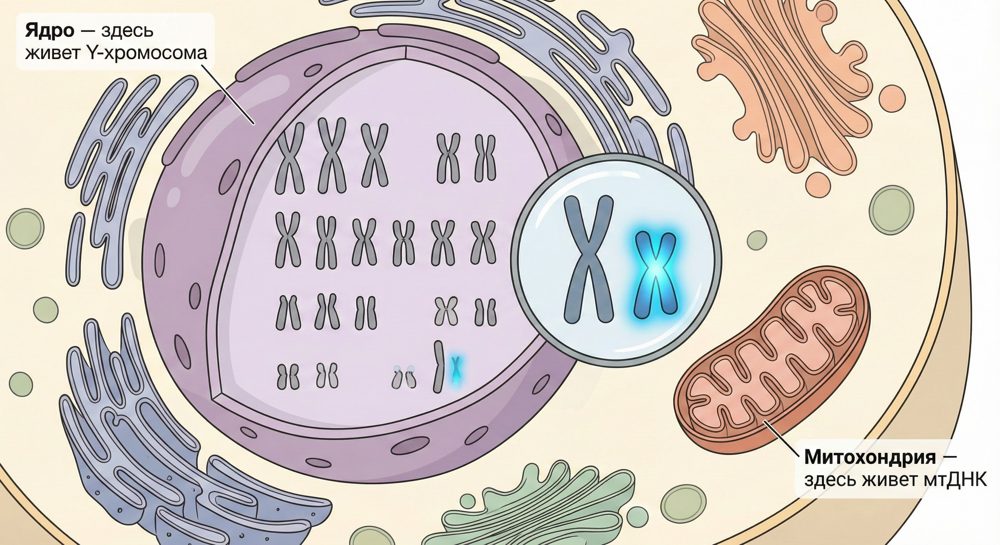
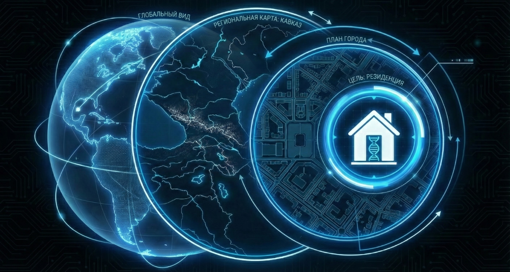
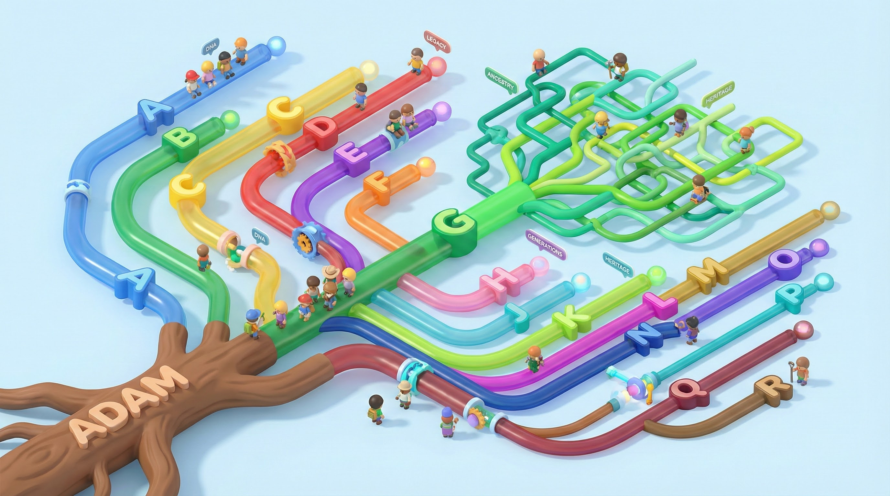
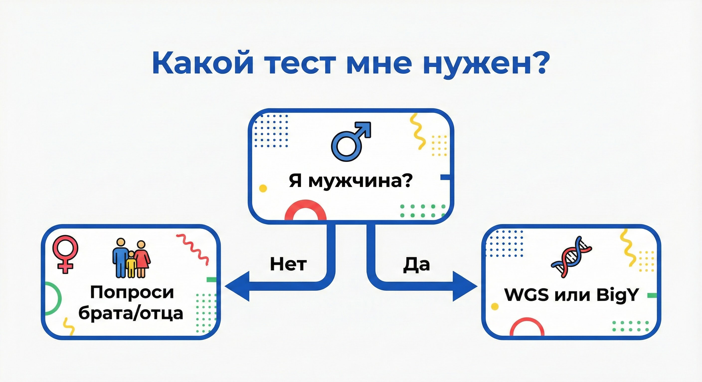

# Словарь на одной странице

Мини-карточки для запоминания.

---

### 🧬 СНИП (SNP)
*   **Что это:** Опечатка в ДНК. Случайная мутация.
*   **Аналогия:** Родинка или шрам, который передается по наследству.

*   **Зачем нужно:** Это "хлебные крошки", по которым мы отслеживаем путь предков. Снипы не исчезают.
*   *Фраза:* "У нас с тобой один снип, значит, у нас был один дедушка."

---

### 🌳 ГАПЛОГРУППА
*   **Что это:** Огромная ветвь человечества (буква: G, R, J).
*   **Аналогия:** Страна происхождения или континент.

*   **Масштаб:** Десятки тысяч лет.
*   *Фраза:* "Мы с тобой из одной гаплогруппы, но это родство времен каменного века."

---

### 🌿 СУБКЛАД (ВЕТКА)
*   **Что это:** Конкретная веточка внутри гаплогруппы.
*   **Аналогия:** Улица или конкретный клан.
*   **Масштаб:** 500 – 4000 лет.
*   *Фраза:* "Мой субклад G-L1264, это чисто адыгская ветка."

---

### ⏳ TMRCA (Time to Most Recent Common Ancestor)
*   **Что это:** Время до общего предка.
*   **Аналогия:** Дата в свидетельстве о рождении прадеда.
*   **Суть:** Компьютер считает разницу в мутациях и говорит: "Ваш общий дед жил 400 лет назад".
*   *Фраза:* "Наш TMRCA всего 300 лет, мы точно родственники!"

---

### 📏 сМ (сантиМорганы)
*   **Что это:** Единица измерения родства по аутосомам.
*   **Аналогия:** "Метры близости". Чем больше цифра, тем ближе родня.
*   **Ориентиры:**
    *   3500 cM = Родители/Дети
    *   2600 cM = Братья/Сестры
    *   100-200 cM = Троюродные
    *   15 cM = Очень далекая родня (или шум).

---

### 📄 ВАРИАНТЫ ТЕСТОВ

*   **WGS (Whole Genome):** "Космос". Прочитано всё. Один раз на всю жизнь. Дорого, но эффективно.
*   **Y-SEQ / BigY:** "Снайпер". Прочитана только Y-хромосома (мужская линия). Очень глубоко.
*   **Чип (Genotek, 23andMe):** "Обзор". Прочитаны случайные точки (0.02%). Дешево. Хорошо для поиска близкой родни (аутосомы), плохо для глубокой истории.
