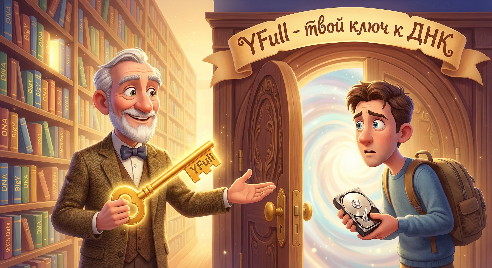
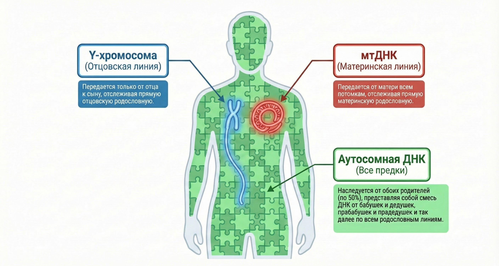

# Я получил WGS. Как понять результат?

Вы заказали самый продвинутый тест в мире (WGS/Full Genome).
Вы ожидали получить красивый PDF-сертификат с гербом и списком родственников.
Вместо этого вам прислали ссылку на скачивание странных файлов (**BAM, FASTQ**) размером в 100 Гигабайт.

**Что это значит? Где мои результаты?**

---

### Аналогия: Библиотека vs Книга

*   **Обычный тест (Genotek/23andMe):** Вы покупаете **брошюру**. Там записано краткое содержание вашей истории. Вы можете прочитать её за вечер, но не можете узнать ничего сверх написанного.
*   **WGS (Полногеномный тест):** Вы купили **всю библиотеку**. В ней есть ВСЕ книги, которые когда-либо были написаны вашим организмом.
    

    Файлы BAM — это и есть эта библиотека. Просто она "закрыта на ключ". Чтобы прочитать конкретную книгу (историю отца, историю матери, болезни), вам нужно взять "ключ" (специальный сервис) и открыть нужную дверь.

---

### Три слоя вашей ДНК

В одном и том же файле BAM хранятся три совершенно разные истории. Они не пересекаются.

#### 1. Y-хромосома (Прямая мужская линия) 🟦
*   **Что это:** "Фамильный столб". История, которая передается от отца к сыну.
*   **Где читать:** Сервис **YFull.com**.
    👉 *Подробнее: [Как читать YFull (Экскурсия по интерфейсу)](../02_Practical/01_YFull_Guide.md)*
*   **Зачем:** Это главное, ради чего мужчины делают тесты.
    *   Покажет, откуда пришел род 4000 лет назад.
    *   Покажет, кто ваши родственники по фамилии (до 500-1000 лет).
    *   Построит детальное Древо.

#### 2. Митохондриальная ДНК (Прямая женская линия) 🟥
*   **Что это:** "Материнское молоко". История, которую передала вам мама, ей — бабушка, ей — прабабушка.
*   **Где читать:** Сервис **YFull MTree** (это отдельная вкладка на том же сайте).
*   **Зачем:**
    *   Узнать глубинные корни мамы.
    *   Обычно это история не фамилий, а древних миграций.

#### 3. Аутосомы (Вся родня сразу) 🟩
*   **Что это:** "Мозаика". Смесь генов всех ваших предков (мамы, папы, дедов с обеих сторон).
*   **Где читать:** **GEDmatch**, **FTDNA**, **Genotek**.
    👉 *Подробнее: [Гайд по аутосомным тестам](../05_Autosomal/01_Autosomal_Only_Guide.md)*
*   **Зачем:**
    *   Найти троюродных/четвероюродных братьев и сестер.
    *   Узнать "этнический состав" (на сколько % вы с Кавказа, а на сколько из Европы).

---

### Главная проблема: "Почему я не вижу брата?"

Вы сдали дорогой WGS. Ваш троюродный брат сдал дешевый тест в Genotek.
Вы заходите на YFull — **его там нет**.
Он заходит в Genotek — **вас там нет**.

Вы в разных мирах.
*   **Вы (WGS):** В "высшей лиге" науки. Вы строите древо.
*   **Он (Чип):** В "массовом секторе". Он ищет близкую родню.

**Как встретиться? (Мост)**

Вам, как обладателю WGS, нужно "спуститься" к нему.
1.  Из вашего огромного файла BAM нужно извлечь маленький файл (формат 23andMe). *Обычно лаборатории делают это по запросу или присылают сразу.*
2.  Этот маленький файл нужно загрузить туда, где сидит брат (в Genotek, FTDNA или GEDmatch).
3.  Там вы встретитесь. Сайт скажет: "Вы совпали!".

---

### Чек-лист понимания

1.  [ ] Я понимаю, что **BAM** — это исходник, а не результат.
2.  [ ] Я знаю, что для мужской линии мне нужно загрузить BAM на **YFull**.
3.  [ ] Я знаю, что для поиска троюродных братьев (у которых нет WGS) мне нужно загрузить файл на **Genotek/FTDNA**.
4.  [ ] Я понимаю, что мой результат будет обновляться всю жизнь. Новые люди будут сдавать тесты — и моё древо будет расти само.

**Вы не просто получили результат. Вы вошли в проект длиною в жизнь.**
