# Как читать YFull — экскурсия по интерфейсу

Вы получили результат WGS/BigY и загрузили его на [YFull.com](https://www.yfull.com/).
Это стоило вам ~49$ (45 евро), но это вклад один раз и на всю жизнь. Он включает анализ и вашей **Y-хромосомы** (отцовская линия), и **мтДНК** (материнская линия).

> [!TIP] 
> 🔗 **Полезные ссылки:**
> *   [YFull Tree (Мужское древо)](https://www.yfull.com/tree/)
> *   [YFull MTree (Женское древо)](https://www.yfull.com/mtree/)
> *   [Словарь терминов](../01_Beginner/04_Dictionary.md) (Если забудете, что такое SNP или TMRCA)

---

## Что вы видите в начале?

Когда вы переходите на общее древо (без указания конкретной ветки), вы видите "корень" всего человечества.

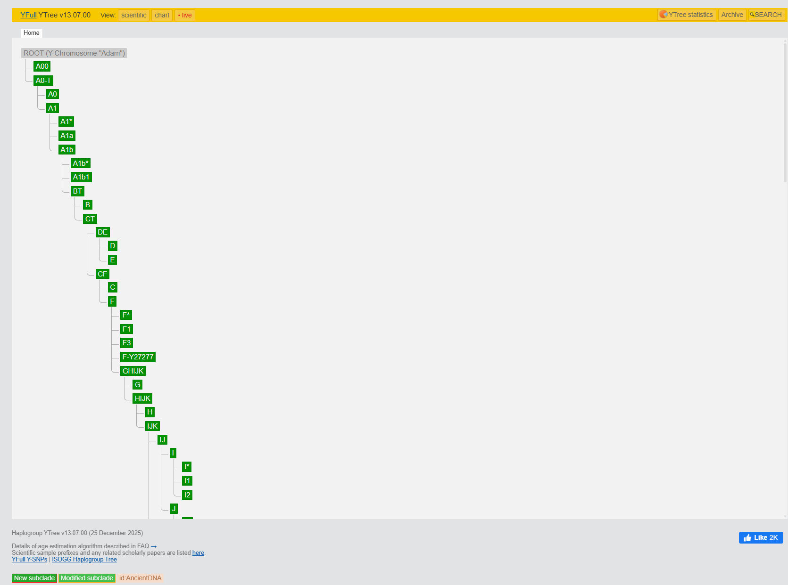

*   Слева сверху и снизу указана **версия древа** (например, v12.00). Оно обновляется регулярно (примерно раз в месяц).
*   Внизу — дата последнего пересчета возрастов.
*   Переключатели режимов (о них позже).

Чтобы понять, как это работает, давайте разберем конкретный пример: ветку **G-L1264** (основная адыго-абхазская линия).
👉 [Ссылка на пример: G-L1264](https://www.yfull.com/tree/G-L1264/)

---

## 1. "Адресная строка" (Вложенность)

> [!TIP]
> **Не пугайтесь длинных кодов!**
> 
> Это просто точный адрес вашего дома на планете ДНК.

### Визуализация адреса
Представьте это как зум на карте:
1.  **Гаплогруппа G** = Планета или Страна.
2.  **P287** = Регион.
3.  **L1264** = Город.
4.  **Ваш ID** = Дом.

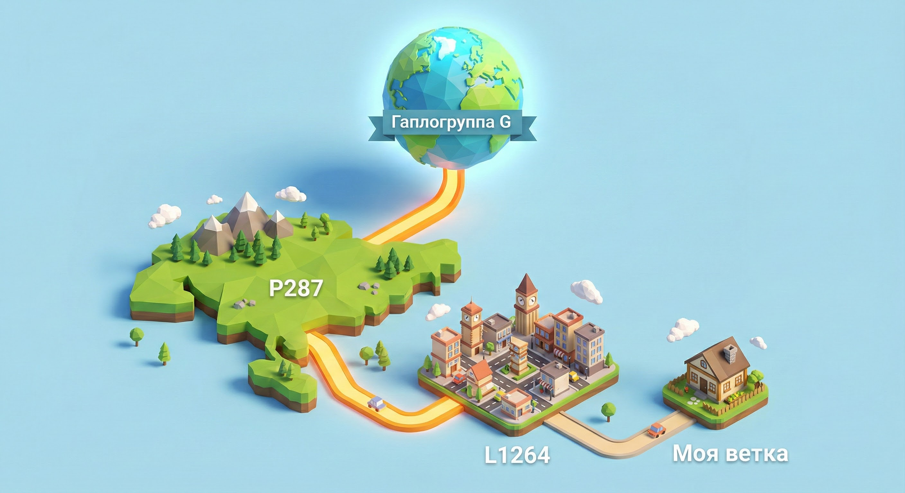

### Корень Человечества (Визуализация)
Вот как может выглядеть начало этой "адресной строки" — корень всего древа (ADAM):

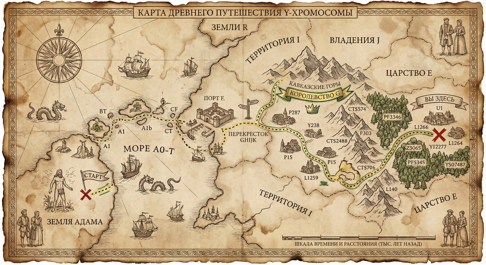

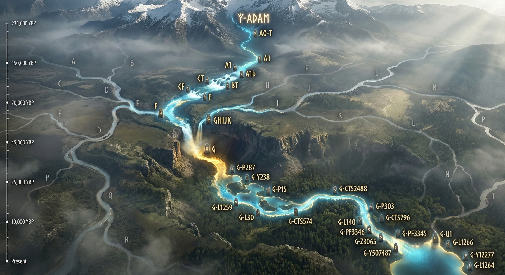

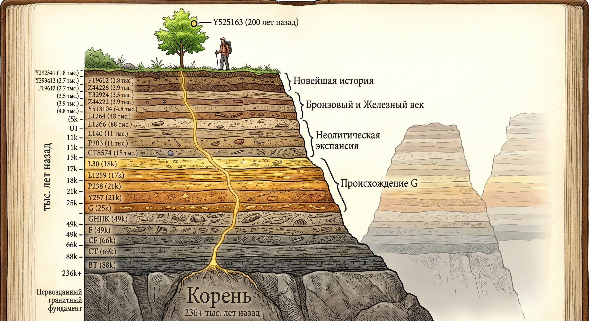

Сверху вы видите длинную цепочку названий:
`Home > A0-T > ... > GHIJK > G > G-P287 > ... > G-L1264`

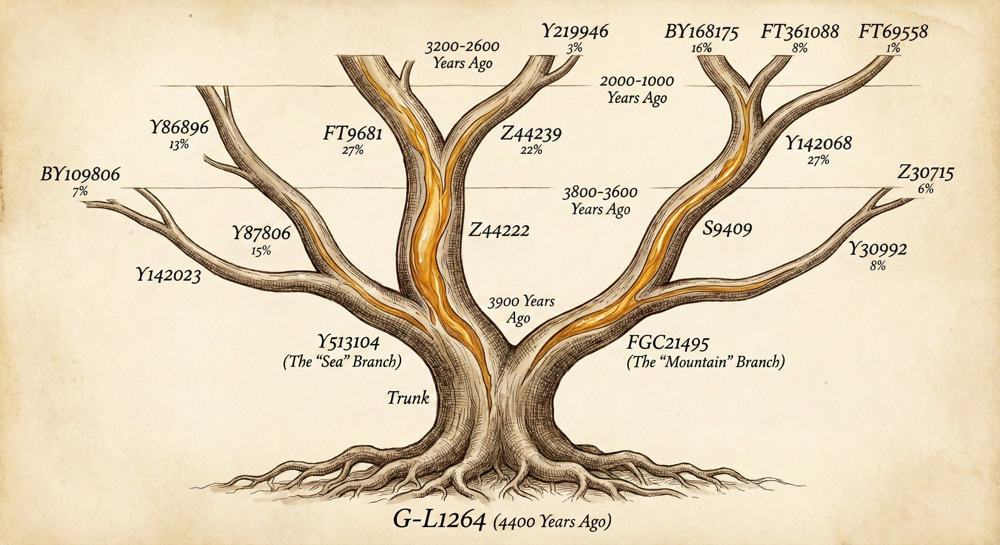

Это ваша родословная с самого начала времен.
*   **A0-T:** "Адам" (общий предок всех людей).
*   **G:** Ваша "планета".
*   **L1264:** Ваш "город" (образовался 4800 лет назад).
*   **G и далее:** Когда в названиях появляется буква **G**, это значит, что история других родов (R, J, E) уже отделилась. С этого момента это история только вашего глобального клана.
*   **Принцип Вселенной:** Ветви расходятся и никогда не сходятся обратно. Это вечное расширение.

---

## 2. Ключевые цифры: Formed и TMRCA

Когда вы открываете любую ветку (например, [G-L1264](https://www.yfull.com/tree/G-L1264/)), вы видите две главные цифры.

> [!IMPORTANT]
> **Formed** (Сформирована) — Когда ветка отделилась от родительской.
> **TMRCA** (Time to Most Recent Common Ancestor) — Когда жил общий предок всех, кто сейчас находится в этой ветке.

В нашем примере:
*   **Formed: 4900 ybp** (лет назад)
*   **TMRCA: 4400 ybp**

### Как это понять?
Взглянем на ветку, которая была "до" (родительскую) — **Y12277**.
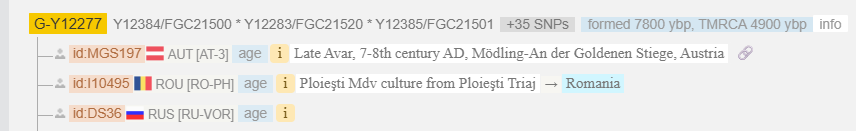
Ее TMRCA = 4900 лет. Это совпадает с Formed нашей ветки L1264.
**Интерпретация:** 4900 лет назад у предка Y12277 родились сыновья.
1.  Один сын дал начало линии **G-L1264**.
2.  Другой сын дал начало линии **G-Y172463**.

С этого момента их потомки разошлись навсегда.

---

## 3. Режимы просмотра (Схема)

Текстовое древо может быть сложным. Нажмите кнопку **[ Chart ]** (Диаграмма) или **[ Simple Chart ]** вверху страницы.

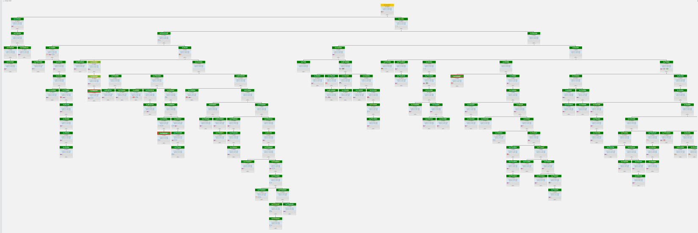

В этом режиме вы сразу видите "развилки".
Верхний блок (другого цвета) — это предок **G-Y12277**. От него вниз уходят две линии:

1.  **G-L1264** (Наша большая ветка)
    

2.  **G-Y172463** (Параллельная братская ветка)
    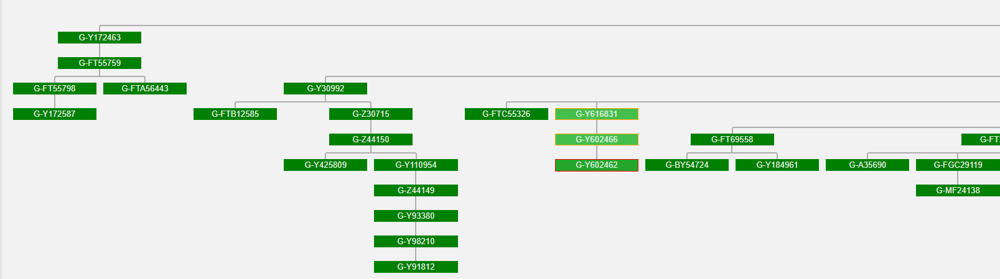

Посмотрите на размеры блоков. G-L1264 огромная, а её "брат" G-Y172463 — маленький. Но по возрасту они **ровесники** (корень уходит в 4900 лет назад). Просто одна линия размножилась сильнее.

### Невидимые разрывы (Туман истории)

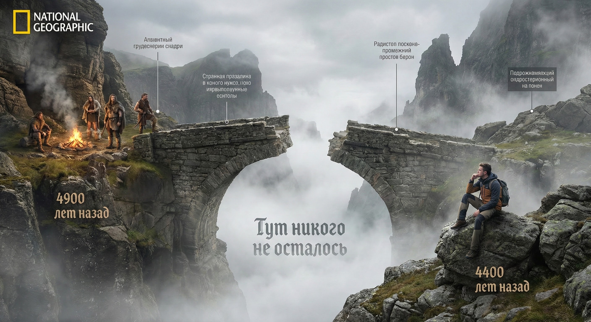

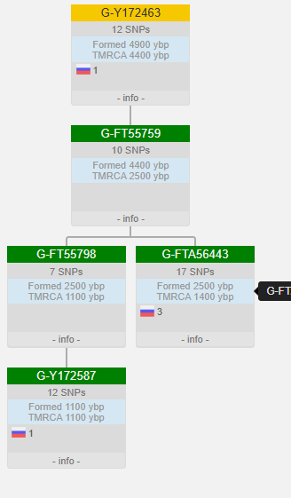

Заметьте: Formed и TMRCA отличаются.
Между 4900 (Formed) и 4400 (TMRCA) — разрыв в 500 лет.
Мы не знаем, что было в эти 500 лет. Потомки рождались, но их боковые линии вымерли "упали в пропасть забвения".

Если мы поднимемся еще выше, к **G-L1266** (дедушка), то увидим еще больший масштаб:
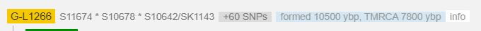
Formed: 10500 лет | TMRCA: 7800 лет.
Разрыв почти 3000 лет! Именно в этом промежутке (мезолит-неолит) предки этих людей пришли на Кавказ.

---

## 4. Вложенность веток (Матрешка)

Внутри G-L1264 есть свои под-ветки:
`G-Y513104`, `G-Z44222`, `G-FT9681` и другие.

**Главное правило:** Вы не можете быть в двух ветках сразу.
Если вы попали в **G-Y513104**, вы автоматически **НЕ** в G-FGC21495. Это параллельные миры.

Чем глубже вы спускаетесь (чем меньше цифра TMRCA), тем ближе к вам эти люди.
*   **Уровень L1264 (4400 лет):** Просто земляки, один народ.
*   **Уровень FT9681 (3900 лет):** Более узкий клан.
*   **Уровень FTA92400 (425 лет):** Это уже однофамильцы или очень близкие рода (Дударуковы, Лиевы, Лоовы).
    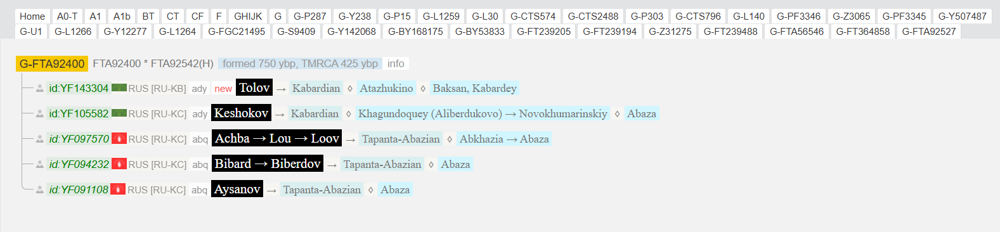

Если у вас обычный тест (не WGS), вы застрянете на верхнем уровне (L1264) и никогда не узнаете, к какому конкретному роду (субэтносу) относитесь.

---

## 5. Что такое SNP (Снип)? Кирпичики древа

Почему древо рисуют именно так? Откуда система знает, где ветка?

Взгляните на подпись под названием ветки:
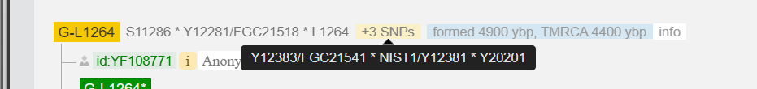

Там перечислены странные коды: `L1264/CTS4825`, `L1271`...
Это **СНИПЫ** (Мутации).
*   У G-L1264 их **6 штук**.
    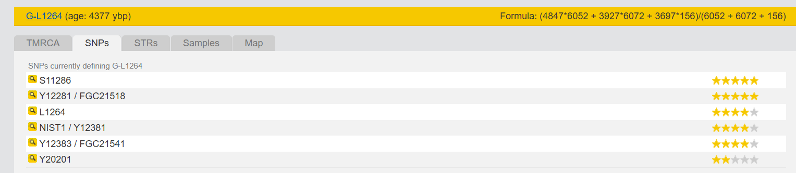
*   Это значит: за 500 лет (от отделения от брата до общего предка) в этой линии накопилось 6 уникальных мутаций.
*   Они есть у ВСЕХ потомков. Это паспорт ветви.

Иногда снипов безумно много. Посмотрите на ветку **A0**:
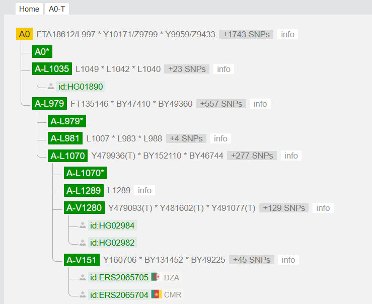
**1747 снипов!** Это гигантская пропасть во времени (100 000 лет), где не выжил никто, кроме одной тонкой линии.

### Личные (Приватные) снипы
Если вы видите звездочки `*` или коды рядом со своим ID — это ваши **приватные снипы**.

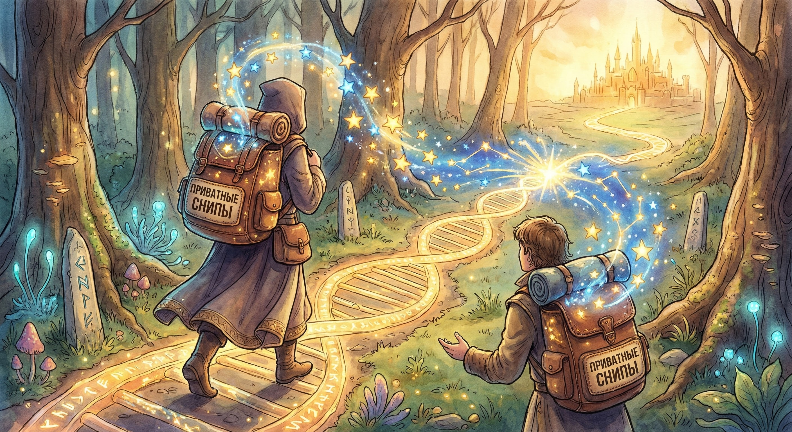

Представьте, что это **ваш личный багаж** (рюкзак), который вы накопили за время пути от общего предка.
Это мутации, которые случились лично у вас (в вашей семье).
Как только ваш брат сдаст тест, вы "встретитесь" на тропе, сравните рюкзаки, и общие звезды вылетят и образуют новую ветку (общий путь).

---

## 6. Можно ли проверить Снип без WGS?

Да, теоретически.
У каждого снипа есть точный адрес на хромосоме.
Если вы знаете, что вы Лоов, и видите ветку **FTA92400** (где сидят другие Лоовы), вы можете заказать в лаборатории YSEQ тест **только на этот один снип** (за ~18$).

*   **Если "+" (есть):** Ура, вы тоже из этой ветки (FTA92400). Вы получаете всю их историю (от Адама до 1600 года) автоматом.
*   **Но:** Вы не появитесь на древе. Вы не узнаете, насколько вы близки к другим. Вы не откроете свою личную ветку. Это "подглядывание" в результат, а не полноценное участие.

---

## 7. Поиск по древу (Как найти любой SNP)

Каждую мутацию (SNP), которая есть на древе, можно найти через встроенный поиск.

1.  Нажмите **[ SEARCH ]** в правом верхнем углу (или иконку лупы).
    

2.  Введите название снипа **без приставки гаплогруппы**.
    *   *Например:* Если вы ищете `G-L1264`, вводите просто `L1264`.
    *   *Причина:* Снип `L1264` уникален, приставка `G-` избыточна.
    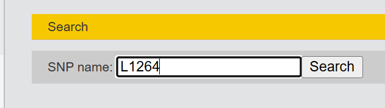

3.  Нажмите кнопку **Search**. Появится зеленая кнопка-ссылка.
    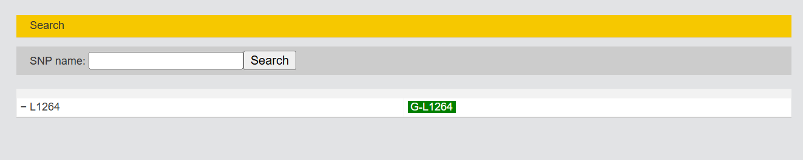
    Нажав на неё, вы попадете прямо в нужную ветку.

> [!NOTE]
> **Магия поиска:**
> Не всегда мы знаем название самой ветки. Но часто у нас есть название SNP из теста.
> *   Если вы введете `S11286` (малоизвестный снип), поиск все равно приведет вас в ветку **G-L1264**.
> *   **Почему?** Потому что снип `S11286` входит в "пакет" снипов, формирующих эту ветку. Это синонимы или "соседи" по блоку мутаций.
>
> 
> *Если поиск по ID не дал результата, попробуйте найти человека по его уникальным снипам на форумах.*

> [!TIP]
> **Итог:**
> Читать древо просто.
> 1.  Ищите себя (свой ID).
> 2.  Смотрите на TMRCA с соседями — это возраст вашего родства.
> 3.  Смотрите на страны соседей — это география рода.
> 4.  Смотрите на "Путь наверх" — это история ваших миграций за тысячи лет.

👉 **Вернуться к началу:** [Как понять результат WGS](../01_Beginner/05_Understanding_WGS.md)
