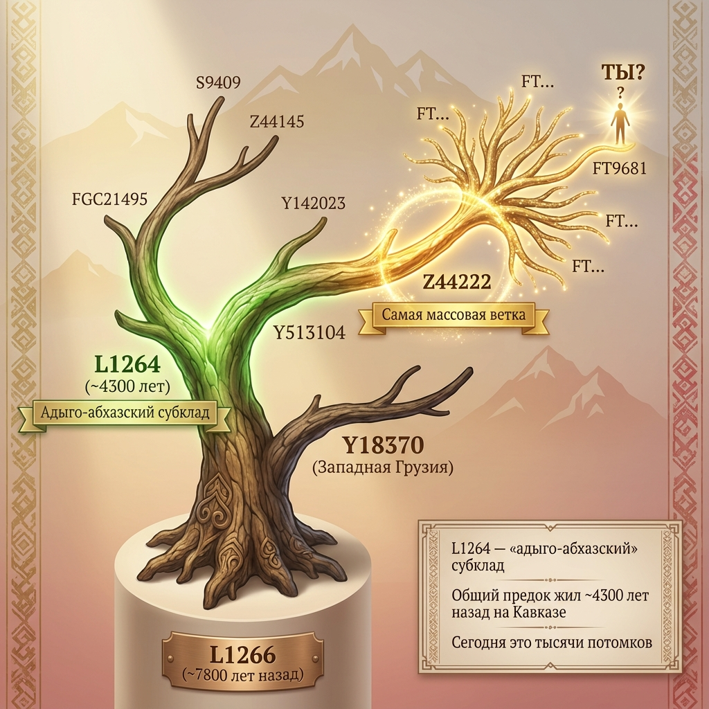

# Структура древа G-L1264: Полный разбор веток



## Введение

G-L1264 — субклад гаплогруппы G2a, наиболее характерный для адыго-абхазских народов. Общий предок всех современных носителей L1264 жил примерно **4300 лет назад** (конец эпохи ранней бронзы, ~2200 BCE).

Эта статья — детальный разбор внутренней структуры L1264 для участников проекта AADNA.

---

## Место L1264 в общем древе

### Путь от Адама до L1264

```
Adam (~200 000 лет)
  └── ...
      └── G (~25 000 лет) — Гаплогруппа G
          └── G2a / P15 (~18 000 лет)
              └── L140 / PF3345 (~12 000 лет)
                  └── U1 (~10 000 лет) — Кавказско-ближневосточная ветка
                      └── L1266 (~7 800 лет) — «Дедушка» L1264
                          ├── Y18370 — Западная Грузия
                          └── Y12277 (~4 800 лет)
                              └── L1264 (~4 300 лет) — Адыго-абхазы
```

### Что это означает?

- **G** (~25 000 лет) — общий предок всех G. Вероятно, Ближний Восток.
- **U1** (~10 000 лет) — кавказско-ближневосточная ветка. Связана с ранними земледельцами.
- **L1266** (~7 800 лет) — «дедушка» L1264. Разделился на две линии:
  - **Y18370** — обосновалась в Западной Грузии
  - **Y12277 → L1264** — адыго-абхазская линия

**Вывод:** Предки L1264 присутствуют на Кавказе минимум 8000 лет. Вероятно, это были одни из первых земледельцев региона.

---

## Внутренняя структура L1264

L1264 разделился на две основные ветви примерно 4000 лет назад:

```
                              L1264
                          (~4 300 лет)
                                │
              ┌─────────────────┴─────────────────┐
              │                                   │
          FGC21495                            Y513104
        (~4 000 лет)                        (~4 000 лет)
              │                                   │
        ┌─────┴─────┐                   ┌─────────┴─────────┐
        │           │                   │                   │
      S9409     Z44145              Y142023             Z44222
   (~2 500 лет) (~2 800 лет)      (~3 500 лет)       (~2 000 лет)
        │           │                   │                   │
    33 ветки    10 веток           редкая            САМАЯ МАССОВАЯ
                                                          │
                                              ┌─────┬─────┼─────┬─────┐
                                              │     │     │     │     │
                                           FT9681  ...   ...   ...   ...
```

---

## Ветка 1: FGC21495

**Возраст:** ~4 000 лет (TMRCA)
**Характеристика:** Менее массовая из двух основных веток

### Структура FGC21495

```
FGC21495
    │
    ├── S9409 (~2 500 лет)
    │       └── 33 внутренних ветки
    │
    ├── Z44145 (~2 800 лет)
    │       └── 10 внутренних веток
    │
    └── FTB64714
            └── редкая древняя линия
```

### S9409

- **Возраст:** ~2 500 лет
- **Количество веток:** 33
- Самая разветвлённая часть FGC21495

### Z44145

- **Возраст:** ~2 800 лет
- **Количество веток:** 10
- Менее разветвлённая, но более древняя

### FTB64714

- Одна из немногих древних линий L1264, пока не представленная в проекте AADNA
- Требуется больше участников для изучения

---

## Ветка 2: Y513104

**Возраст:** ~4 000 лет
**Характеристика:** Более массовая ветка, включает большинство носителей L1264

### Структура Y513104

```
Y513104
    │
    ├── Y142023 (~3 500 лет)
    │       └── редкая линия
    │
    └── Z44222 (~2 000 лет)
            └── САМАЯ МАССОВАЯ ВЕТКА L1264
                    │
                    ├── FT9681 — особенно распространена у кабардинцев
                    ├── FT8888
                    ├── FT7777
                    └── другие ветки...
```

### Y142023

- **Возраст:** ~3 500 лет
- **Распространённость:** Редкая
- Одна из самых древних внутренних линий Y513104

### Z44222 — «Звезда» L1264

- **Возраст:** ~2 000 лет
- **Характеристика:** Самая массовая ветка L1264
- **Особенность:** Особенно выделяется у кабардинцев

Z44222 демонстрирует классический «звёздный взрыв» — быстрое разветвление за короткий период. Это указывает на демографический успех: у одного предка было много выживших сыновей, которые основали множество линий.

---

## Географическое распределение

### Основной ареал

| Регион | Преобладающие ветки |
|--------|---------------------|
| **Кабарда** | Z44222 (особенно FT9681) |
| **Адыгея** | Z44222, FGC21495 |
| **Абхазия** | Разнообразие веток |
| **Западная Грузия** | Y18370 (братская линия) |

### Диаспора

L1264 также встречается среди:
- Потомков мухаджиров в Турции, Сирии, Иордании
- Единичных носителей в Европе, на Ближнем Востоке, в Иране

Находки в других регионах могут отражать древние миграции эпохи бронзы с Кавказа.

---

## Древняя ДНК

### Подтверждённые находки

**Ямное погребение на Северо-Западном Кавказе** (Nedoluzhko et al., 2014)
- Обнаружен L1264
- Датировка: эпоха бронзы
- Значение: подтверждает древность L1264 на Кавказе

### Что это означает?

Находка L1264 в древнем погребении доказывает:
1. Линия присутствовала на Кавказе тысячи лет назад
2. Это не поздние мигранты
3. Носители L1264 — коренное население региона

---

## Исторический контекст

### Эпоха формирования L1264 (~2200 BCE)

Рубеж 3-2 тысячелетия до н.э. — время активных процессов на Кавказе:

| Культура/Событие | Период | Связь с L1264 |
|------------------|--------|---------------|
| **Майкопская культура** | 3700-2500 BCE | Возможные предки |
| **Ямная культура** | 3300-2600 BCE | Контакты со степью |
| **Куро-араксская культура** | 3400-2000 BCE | Миграции через Кавказ |
| **Кобанская культура** | 1200-400 BCE | Поздние потомки |

### Гипотеза происхождения

1. **L1266** (~7 800 лет) — вероятно, среди первых земледельцев Западного Кавказа
2. Разделение на **грузинскую** (Y18370) и **адыго-абхазскую** (L1264) линии
3. **L1264** формируется в эпоху бронзы (~4 300 лет)
4. **Звёздный взрыв Z44222** (~2 000 лет) — демографический расцвет

---

## Как найти свою ветку

### Шаг 1: Найди терминальный снип

Посмотри свой результат на YFull. Найди последний код в цепочке:

```
... > L1264 > Z44222 > FT9681
                           ↑
                    Твой терминальный снип
```

### Шаг 2: Определи свою ветку

| Если в цепочке есть... | Твоя ветка |
|------------------------|------------|
| FGC21495 | Ветка 1 (меньшая) |
| S9409 | Подветка FGC21495 |
| Z44145 | Подветка FGC21495 |
| Y513104 | Ветка 2 (большая) |
| Y142023 | Редкая подветка Y513104 |
| Z44222 | Массовая подветка Y513104 |
| FT9681 | Кабардинская линия Z44222 |

### Шаг 3: Найди соседей

На YFull посмотри, кто находится на соседних ветках. Обрати внимание на:
- TMRCA (когда жил общий предок)
- Страну/регион совпаденца
- Фамилию (если указана)

---

## Значение для участников AADNA

### Каждый тест уточняет древо

Когда ты загружаешь данные на YFull:
- Твоя ветка может разделиться (появятся новые снипы)
- Уточняются даты TMRCA
- Обнаруживаются связи с другими участниками

### Пустые ветки

Некоторые древние линии (например, FTB64714) пока не представлены в проекте. Если твоя ветка выглядит «одинокой» — возможно, ты первый из своего рода, кто сдал глубокий тест.

### Связь с историей

Структура древа L1264 — это отпечаток истории адыго-абхазских народов:
- **Бутылочные горлышки** — периоды кризисов
- **Звёздные взрывы** — периоды расцвета
- **Разветвления** — формирование отдельных родов

---

## Схема полного древа L1264

```
                                    L1266
                                (~7 800 лет)
                                     │
                       ┌─────────────┴─────────────┐
                       │                           │
                    Y18370                      Y12277
               (Зап. Грузия)                  (~4 800 лет)
                                                   │
                                                L1264
                                            (~4 300 лет)
                                                   │
                         ┌─────────────────────────┴─────────────────────────┐
                         │                                                   │
                     FGC21495                                            Y513104
                   (~4 000 лет)                                        (~4 000 лет)
                         │                                                   │
               ┌─────────┼─────────┐                           ┌─────────────┴─────────────┐
               │         │         │                           │                           │
            S9409    Z44145   FTB64714                     Y142023                     Z44222
         (~2 500)  (~2 800)   (редкая)                   (~3 500)                   (~2 000)
               │         │                                   │                           │
           33 ветки  10 веток                            редкая               ┌────┬────┬────┬────┐
                                                                              │    │    │    │    │
                                                                           FT... FT... FT9681 ...  ...
                                                                                         │
                                                                                   Кабардинцы
```

---

## Полезные ссылки

- **Древо L1264 на YFull:** [yfull.com/tree/G-L1264](https://www.yfull.com/tree/G-L1264/)
- **Древо L1266 (предковая линия):** [yfull.com/tree/G-L1266](https://www.yfull.com/tree/G-L1266/)
- **Проект AADNA:** [aadna.ru](https://aadna.ru)

---

## Заключение

L1264 — это не просто код. Это 4300 лет истории, записанной в ДНК. Каждая ветка — след конкретного человека, который жил, выживал, оставлял потомков.

Изучая структуру древа, мы восстанавливаем историю народа: периоды расцвета и кризисов, миграции и расселение, формирование родов и кланов.

**Каждый участник AADNA добавляет новую страницу в эту историю.**
