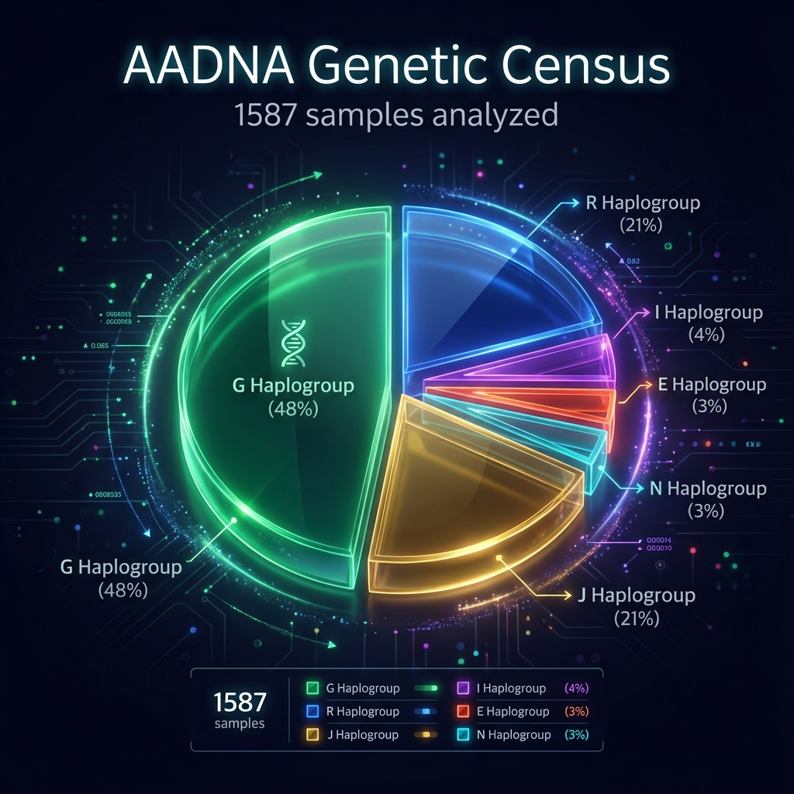
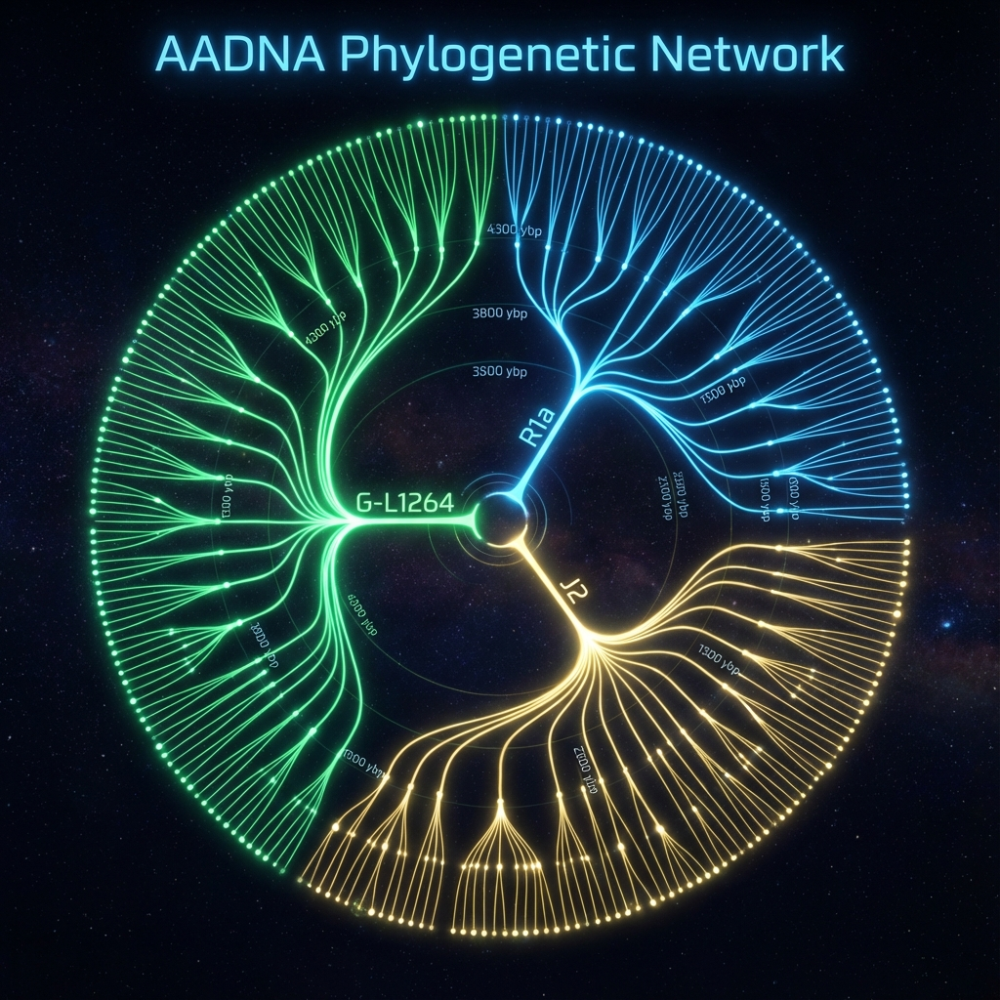
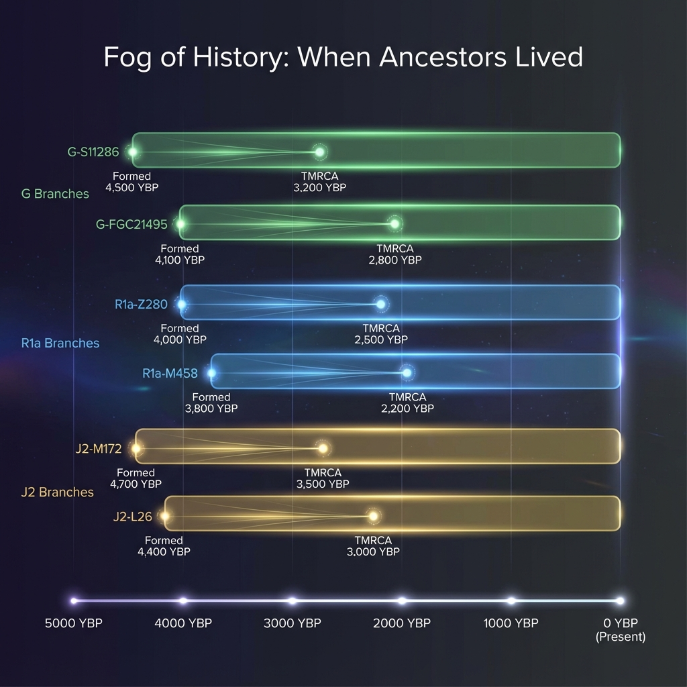
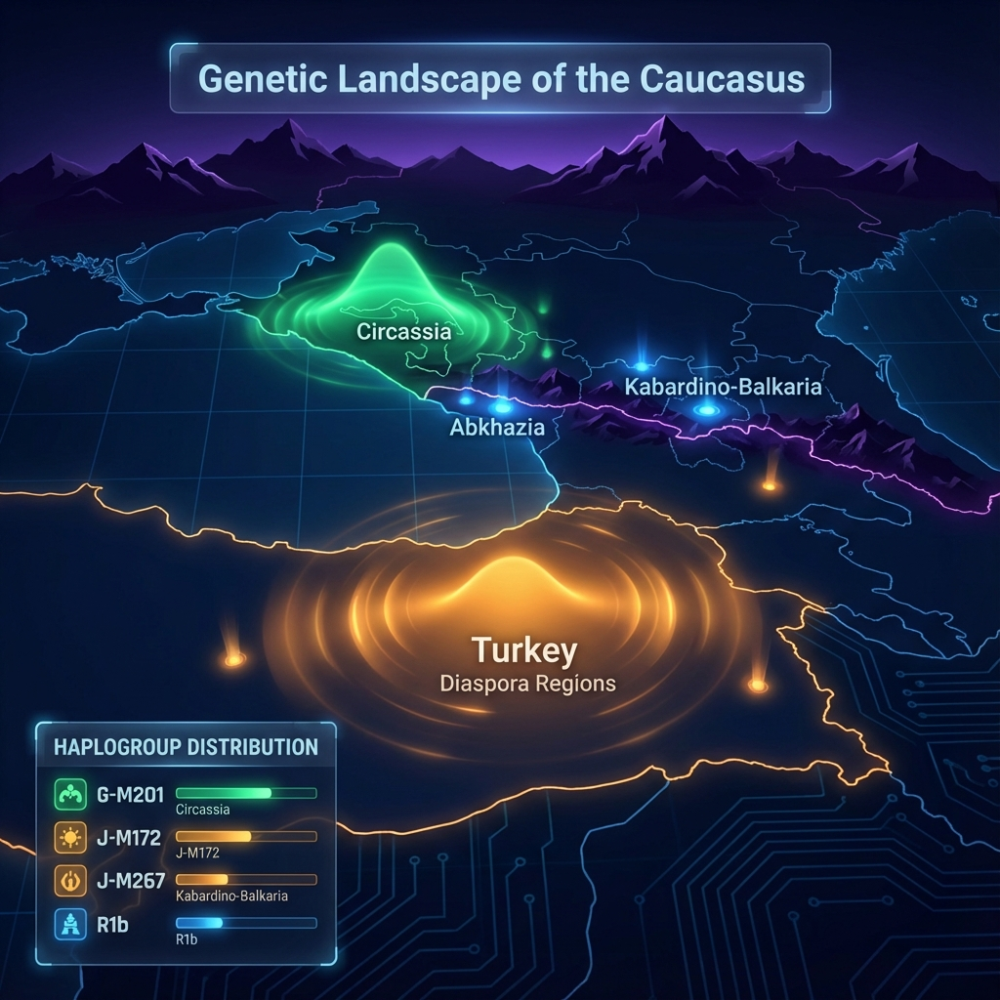
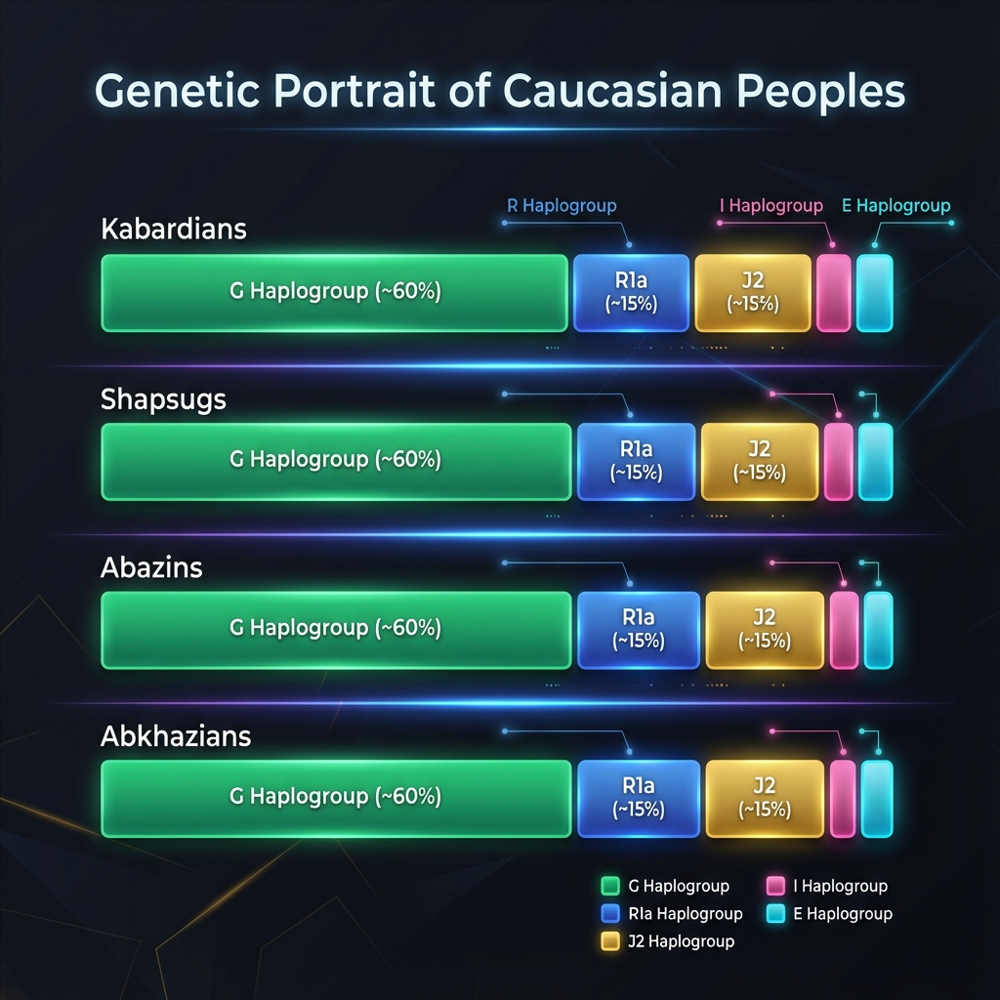
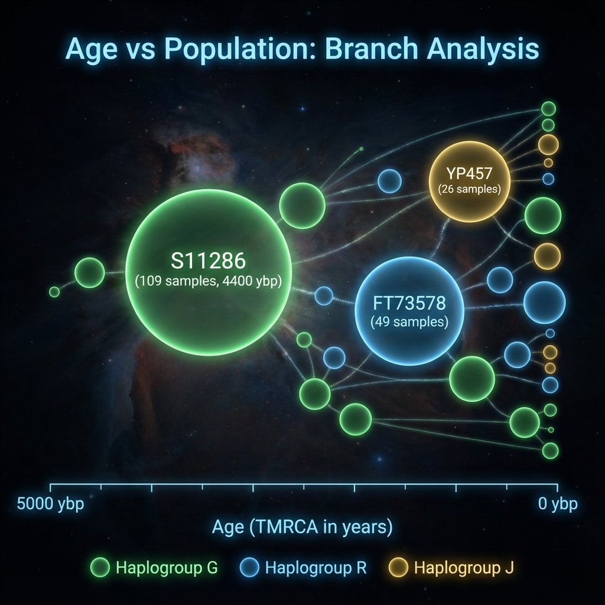
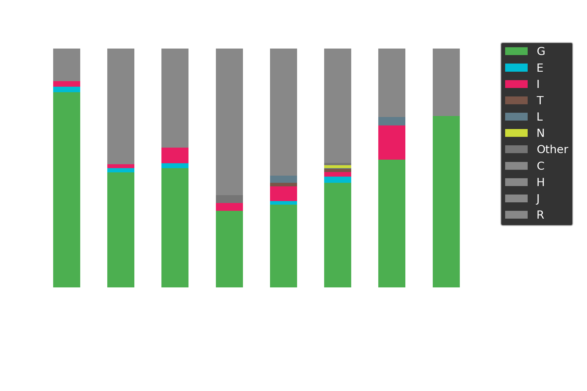
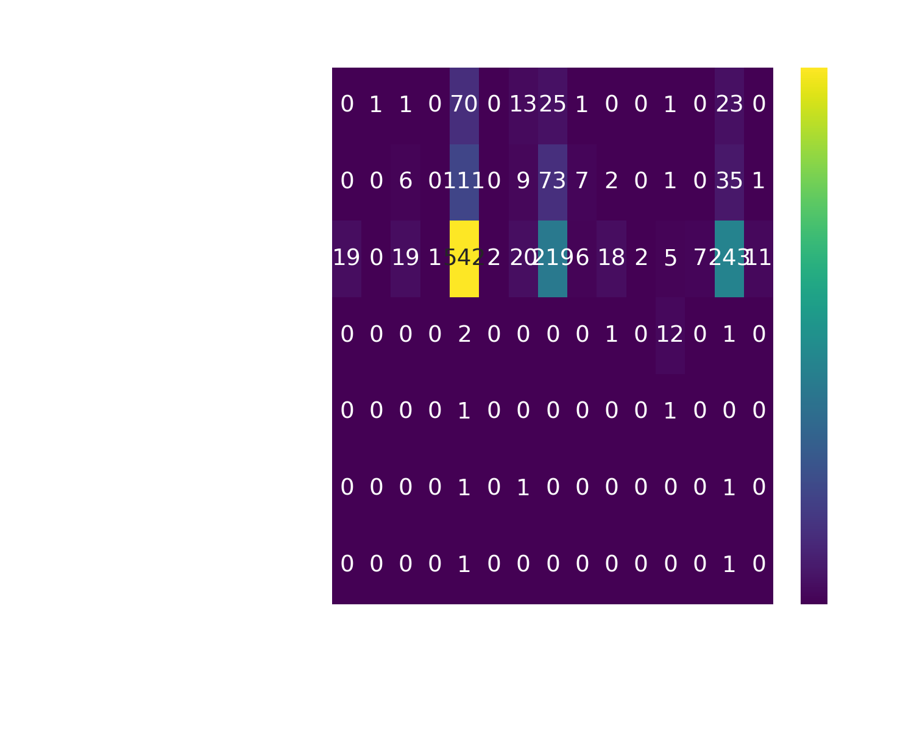
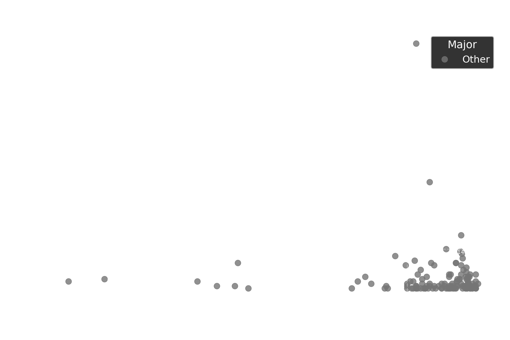

# 🖼️ Галерея Визуализации AADNA

## 1. AI-Generated Premium (Claude Opus)

### Генетическая Перепись (Pie Chart)
*Распределение мажорных гаплогрупп в базе данных AADNA.*

### Филогенетическая Сеть (Radial Tree)
*Эволюционные связи между субкладами проекта.*

### Туман Истории (Timeline)
*Когда жили предки: от образования мутации до общего предка (TMRCA).*

### Генетический Ландшафт Кавказа (Geo Heatmap)
*Географическое распределение участников проекта.*

### Генетический Портрет Народов (Subethnos Comparison)
*Сравнение гаплогрупп между субэтносами.*

### Возраст vs Популярность (Branch Bubbles)
*Пузырьковая диаграмма: размер = количество образцов, положение = возраст ветви.*

---

## 2. Базовая Статистика (Matplotlib)

### Распределение Мажорных Гаплогрупп (Donut Chart)

### Топ-15 Ветвей (Horizontal Bar)

### Туман Истории (Dumbbell Chart)

---

## 3. Расширенная Аналитика (Matplotlib)

### Состав Субэтносов (Stacked Bar)

### Географическая Тепловая Карта (Heatmap)

### "Звездные Скопления" (Scatter Plot)

### Топ Локации (Bar Chart)

