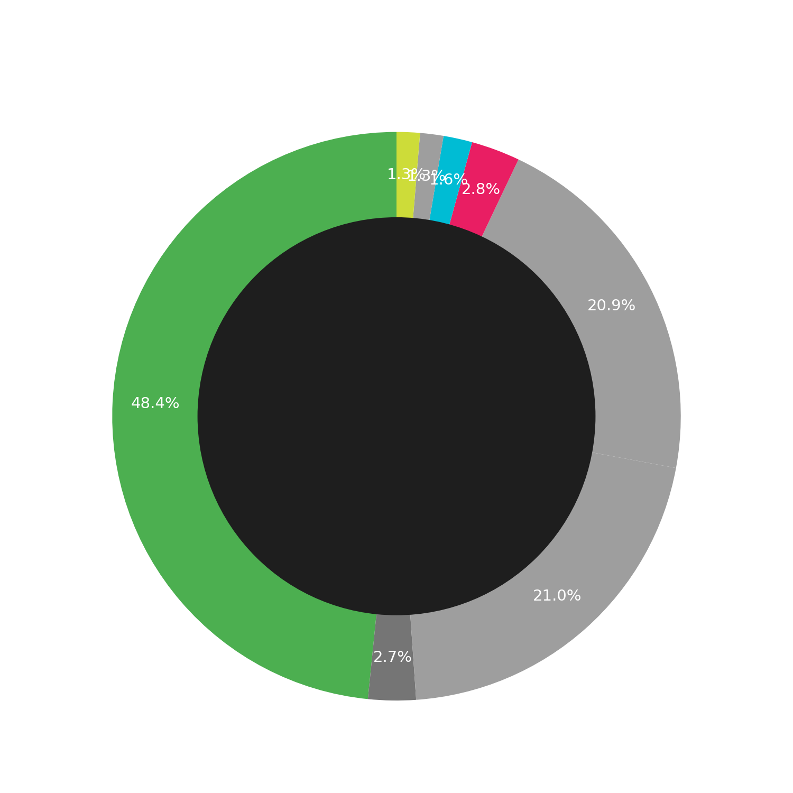
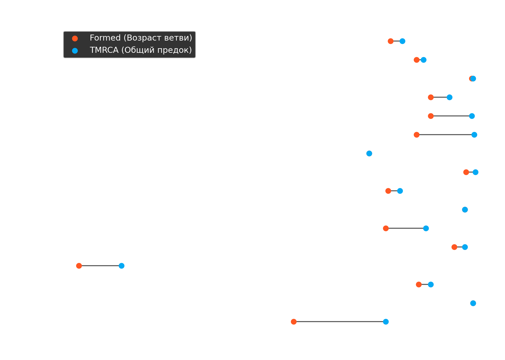

# AADNA Project: Генетическая Статистика

**Всего образцов в базе:** 1587

> [!NOTE]
> Эта статистика основана на открытых данных проекта `aadna.ru`. Возраст линий рассчитан по дереву YFull/FTDNA (версия `current_tree.json`).

## 🧬 Мажорные Гаплогруппы

| Гаплогруппа | Количество | Доля |
|---|---|---|
| **G** | 768 | 48.4% |
| **J** | 333 | 21.0% |
| **R** | 331 | 20.9% |
| **I** | 44 | 2.8% |
| **E** | 26 | 1.6% |
| **C** | 21 | 1.3% |
| **N** | 21 | 1.3% |
| **L** | 16 | 1.0% |
| **T** | 12 | 0.8% |
| **Q** | 7 | 0.4% |
| **O** | 4 | 0.3% |
| **H** | 2 | 0.1% |
| **D** | 1 | 0.1% |
| **F** | 1 | 0.1% |

## 📉 Туман Истории: Анализ Возраста
> [!TIP]
> График ниже ("гантель") показывает разрыв между возрастом мутации (Formed) и временем жизни общего предка (TMRCA). Длина линии — это "скрытая история" ветви.

## 🌳 Детальный обзор веток (5+ образцов)

Для каждой крупной ветки приведена информация о возрасте (TMRCA) и географии.

### S11286
**Образцов:** 109

*   **Возраст ветки (Formed):** 4900 лет
*   **Общий предок (TMRCA):** 4400 лет
*   **Субэтносы:** Кабардинец (35), Шапсуг (7), Ашхаруа (6)
*   **Страны:** Circassia (94), Abaza (8), Abkhazia (5)
*   **Локации:** Каменномостское (3), Нартан (2), Старо-Кувинск (2)

---
### FT73578
**Образцов:** 49

*   **Возраст ветки (Formed):** 3800 лет
*   **Общий предок (TMRCA):** 3500 лет
*   **Субэтносы:** Кабардинец (15), ец (4), абжьыуа (3)
*   **Страны:** Circassia (37), Abkhazia (9), Abaza (2)
*   **Локации:** Инаркой (3), Кошехабль (2), Егерухай (2)

---
### Z45053
**Образцов:** 28

*   **Возраст ветки (Formed):** н/д
*   **Общий предок (TMRCA):** н/д
*   **Субэтносы:** Кабардинец (13), Абжуа (Абжьыуа) (3), Тапанта (3)
*   **Страны:** Circassia (18), Abkhazia (6), Abaza (3)
*   **Локации:** Отап (Уатаԥ) (2), Дейское (1), Арик (1)

---
### YP457/FGC22480
**Образцов:** 26

*   **Возраст ветки (Formed):** 1450 лет
*   **Общий предок (TMRCA):** 1400 лет
*   **Субэтносы:** Кабардинец (15), Абхаз (1), Тапанта (1)
*   **Страны:** Circassia (18), Abaza (2), Abkhazia (2)
*   **Локации:** Нартан (1), Алтуд (1), Кургоковский (1)

---
### Y93425
**Образцов:** 20

*   **Возраст ветки (Formed):** 3200 лет
*   **Общий предок (TMRCA):** 2400 лет
*   **Субэтносы:** Абадзех (4), Абжуа (Абжьыуа) (3), Ашхарец (3)
*   **Страны:** Circassia (9), Abkhazia (8), Abaza (3)
*   **Локации:** Хатуей (3), Отап (3), Апсуа (2)

---
### FTA78507
**Образцов:** 19

*   **Возраст ветки (Formed):** 3200 лет
*   **Общий предок (TMRCA):** 1450 лет
*   **Субэтносы:** Абжуа (Абжьыуа) (6), Кабардинец (5), Ашхаруа (2)
*   **Страны:** Abkhazia (10), Circassia (5), Abaza (4)
*   **Локации:** Отап (Уатаԥ) (4), Нижний Курп (2), Пакуащь (Ҧақәашь) (1)

---
### FT239125
**Образцов:** 18

*   **Возраст ветки (Formed):** 3800 лет
*   **Общий предок (TMRCA):** 1350 лет
*   **Субэтносы:** Кабардинец (7), Тапанта (4), Абазин (1)
*   **Страны:** Abaza (9), Circassia (7), Abkhazia (1)
*   **Локации:** Карт-Джурт (1), Ходзь (1), Кахун (1)

---
### Y6096
**Образцов:** 17

*   **Возраст ветки (Formed):** н/д
*   **Общий предок (TMRCA):** н/д
*   **Субэтносы:** Ашхаруа (7), Кабардинец (3), Ашхарец (2)
*   **Страны:** Abaza (11), Circassia (4), Abkhazia (2)
*   **Локации:** Апсуа (4), Аацы (1), Баг-хабла (1)

---
### Y29716
**Образцов:** 17

*   **Возраст ветки (Formed):** 5800 лет
*   **Общий предок (TMRCA):** 5800 лет
*   **Субэтносы:** Кабардинец (11), Абжуа (Абжьыуа) (3), Бзып (Бзыԥ) (2)
*   **Страны:** Circassia (11), Abkhazia (6)
*   **Локации:** Пакуашь (Ҧақәашь) (2), Псыхурей (1), Каменномостское (1)

---
### FT14005
**Образцов:** 16

*   **Возраст ветки (Formed):** 1700 лет
*   **Общий предок (TMRCA):** 1300 лет
*   **Субэтносы:** Абадзех (4), Кабардинец (3), Убых (2)
*   **Страны:** Circassia (14), Abaza (1), Abkhazia (1)
*   **Локации:** Мамхег (1), Хакуринохабль (1), Вольнй Аул (1)

---
### Y489133
**Образцов:** 15

*   **Возраст ветки (Formed):** 5000 лет
*   **Общий предок (TMRCA):** 4500 лет
*   **Субэтносы:** Кабардинец (9), Абхаз (Псхувец) (1), Бзып (Бзыԥ) (1)
*   **Страны:** Circassia (11), Abkhazia (3)
*   **Локации:** Анзорей (1), Нартан (1), Черкесск (1)

---
### FGC80745
**Образцов:** 14

*   **Возраст ветки (Formed):** 18100 лет
*   **Общий предок (TMRCA):** 16300 лет
*   **Субэтносы:** Кабардинец (7), Абхаз (1)
*   **Страны:** Circassia (12), Abkhazia (1)
*   **Локации:** Инаркой (1), Плановское (1), Дамаск (1)

---
### Z44149
**Образцов:** 14

*   **Возраст ветки (Formed):** 1750 лет
*   **Общий предок (TMRCA):** 1750 лет
*   **Субэтносы:** Кабардинец (12), Кабардинец* (1), Бзып (Бзыԥ) (1)
*   **Страны:** Circassia (13), Abkhazia (1)
*   **Локации:** Заюково (3), Нижний Куркужин (2), Н. Куркужин (1)

---
### Y292541
**Образцов:** 14

*   **Возраст ветки (Formed):** 2200 лет
*   **Общий предок (TMRCA):** 1750 лет
*   **Субэтносы:** Кабардинец (11), Самурзаканец (1), абзыԥ (1)
*   **Страны:** Circassia (11), Abkhazia (2), Kumuk (1)
*   **Локации:** Нижний Курп (2), Инаркой (1), Куба (1)

---
### FT223140/Y182203
**Образцов:** 14

*   **Возраст ветки (Formed):** 5100 лет
*   **Общий предок (TMRCA):** 3400 лет
*   **Субэтносы:** Бзып (Бзыԥ) (5), Тапанта (2), Самурзакан (Мырзаҟан) (1)
*   **Страны:** Abkhazia (10), Abaza (3), Circassia (1)
*   **Локации:** Бармыш (Бармышь) (1), Царча (Ҵарча) (1), Эльбурган (1)

---
### BY74941
**Образцов:** 13

*   **Возраст ветки (Formed):** 1400 лет
*   **Общий предок (TMRCA):** 1400 лет
*   **Субэтносы:** Кабардинец (2), Убых (2), Abaza (1)
*   **Страны:** Circassia (12)
*   **Локации:** Абазауна Хабль (1), Кфар-Кама (1), Turkey (1)

---
### BY227844
**Образцов:** 13

*   **Возраст ветки (Formed):** 3700 лет
*   **Общий предок (TMRCA):** 3200 лет
*   **Субэтносы:** Кабардинец (5), Абжуа (Абжьыуа) (2), Абадзех (1)
*   **Страны:** Circassia (8), Abkhazia (4)
*   **Локации:** Аймара (2), Кенже (1), Атажукино (1)

---
### SK1318
**Образцов:** 13

*   **Возраст ветки (Formed):** 9000 лет
*   **Общий предок (TMRCA):** 5100 лет
*   **Субэтносы:** Кабардинец (3), Бжедуг (2), Бзып (Бзыԥ) (1)
*   **Страны:** Circassia (9), Abkhazia (3), Abaza (1)
*   **Локации:** Анхуа (Анхәа) (1), Нартан (1), Лыхны (1)

---
### Z44226
**Образцов:** 12

*   **Возраст ветки (Formed):** н/д
*   **Общий предок (TMRCA):** н/д
*   **Субэтносы:** Кабардинец (3), Абадзех (2), Шапсуг (1)
*   **Страны:** Circassia (10), Abaza (1), Abkhazia (1)
*   **Локации:** Адамий (1), Эльбурган (1), Хабез (1)

---
### FT230654
**Образцов:** 12

*   **Возраст ветки (Formed):** 1400 лет
*   **Общий предок (TMRCA):** 1050 лет
*   **Субэтносы:** Кабардинец (7), ец (1), Абазин (1)
*   **Страны:** Circassia (11), Abaza (1)
*   **Локации:** Н.Куркужин (1), Псыхурей (1)

---
### FTA57363
**Образцов:** 11

*   **Возраст ветки (Formed):** 1800 лет
*   **Общий предок (TMRCA):** 1250 лет
*   **Субэтносы:** Натухай (3), Бжедуг (2), Шапсуг (2)
*   **Страны:** Circassia (11)
*   **Локации:** Бжегокай (1), Старобжегокай (1), Куба (1)

---
### Z35859
**Образцов:** 11

*   **Возраст ветки (Formed):** н/д
*   **Общий предок (TMRCA):** н/д
*   **Субэтносы:** Кабардинец (3), Бзып (Бзыԥ) (3), Тапанта (1)
*   **Страны:** Abkhazia (5), Circassia (4), Abaza (2)
*   **Локации:** Псыж (1), Баксаненок (1), Егерухай (1)

---
### Y60998
**Образцов:** 11

*   **Возраст ветки (Formed):** 4100 лет
*   **Общий предок (TMRCA):** 4100 лет
*   **Субэтносы:** Абжуа (Абжьыуа) (9)
*   **Страны:** Abkhazia (11)
*   **Локации:** Отап (Уатаԥ) (2), Аимара (2), Члоу (Ҷлоу) (1)

---
### FT143629
**Образцов:** 10

*   **Возраст ветки (Formed):** 1050 лет
*   **Общий предок (TMRCA):** 1050 лет
*   **Субэтносы:** Кабардинец (5), Абадзех (1), Шапсуг (1)
*   **Страны:** Circassia (9), Abaza (1)
*   **Локации:** Баксаненок (3), Исламей (2)

---
### FT8688
**Образцов:** 10

*   **Возраст ветки (Formed):** н/д
*   **Общий предок (TMRCA):** н/д
*   **Субэтносы:** Тапанта (8), Кабардинец (2)
*   **Страны:** Abaza (8), Circassia (2)
*   **Локации:** Малка (7), Залукокоаже (2), Каменномостское (1)

---
### Z7940/FGC724
**Образцов:** 9

*   **Возраст ветки (Formed):** 4300 лет
*   **Общий предок (TMRCA):** 4300 лет
*   **Субэтносы:** Кабардинец (3), Абжуа (Абжьыуа) (1), Пакуаш (1)
*   **Страны:** Circassia (5), Abkhazia (4)
*   **Локации:** Лашкиндар (1), Баксан (1), Урупский (1)

---
### FTA56443
**Образцов:** 9

*   **Возраст ветки (Formed):** 2500 лет
*   **Общий предок (TMRCA):** 1400 лет
*   **Субэтносы:** Мамхег (2), ец (1), Егерухай (1)
*   **Страны:** Circassia (8), Abaza (1)
*   **Локации:** Хакуринохабль (1), Бесленей (1), Мамхег (1)

---
### FT79830/Y175973
**Образцов:** 9

*   **Возраст ветки (Formed):** 3000 лет
*   **Общий предок (TMRCA):** 2200 лет
*   **Субэтносы:** Кабардинец (7)
*   **Страны:** Circassia (8)
*   **Локации:** Нартан (3), Сармаково (1), Сирия->Нартан->США (1)

---
### FT388007
**Образцов:** 9

*   **Возраст ветки (Formed):** 3800 лет
*   **Общий предок (TMRCA):** 2100 лет
*   **Субэтносы:** Кабардинец (6), Бжедуг (2)
*   **Страны:** Circassia (9)
*   **Локации:** Кенже (1)

---
### Y219854/FT384320
**Образцов:** 9

*   **Возраст ветки (Formed):** 1400 лет
*   **Общий предок (TMRCA):** 425 лет
*   **Субэтносы:** Кабардинец (8)
*   **Страны:** Circassia (8)
*   **Локации:** Куба (3), Каменномостское (2), Чегем (1)

---
### FT79135
**Образцов:** 9

*   **Возраст ветки (Formed):** 1150 лет
*   **Общий предок (TMRCA):** 800 лет
*   **Субэтносы:** Кабардинец (9)
*   **Страны:** Circassia (9)
*   **Локации:** Хабез (1), Баксан (1), Верхний Акбаш (1)

---
### Y4541/FGC16328/SK1075/F5481
**Образцов:** 8

*   **Возраст ветки (Formed):** 1400 лет
*   **Общий предок (TMRCA):** 950 лет
*   **Субэтносы:** Кабардинец (7), Темиргоевец (1)
*   **Страны:** Circassia (8)
*   **Локации:** Малка (1), Сирия (1), Псаучье-Дахе (1)

---
### FGC674/Z7949
**Образцов:** 8

*   **Возраст ветки (Formed):** 2600 лет
*   **Общий предок (TMRCA):** 1100 лет
*   **Субэтносы:** Кабардинец (6), * (1), Кабардинец* (1)
*   **Страны:** Circassia (8)
*   **Локации:** Дейское (1), Атажукино (1), Исламей (1)

---
### Y18376
**Образцов:** 8

*   **Возраст ветки (Formed):** 2200 лет
*   **Общий предок (TMRCA):** 2200 лет
*   **Субэтносы:** Кабардинец (4), Бзыпец (1), Абжуец (1)
*   **Страны:** Circassia (4), Abkhazia (3)
*   **Локации:** Отахара (1), Каменномостское -> Залукодес (1), Джгерда (1)

---
### FGC21507
**Образцов:** 8

*   **Возраст ветки (Formed):** 10500 лет
*   **Общий предок (TMRCA):** 7800 лет
*   **Субэтносы:** Кабардинец (2)
*   **Страны:** Circassia (2), Abkhazia (2)
*   **Локации:** Сармаково (1)

---
### FTA36456
**Образцов:** 8

*   **Возраст ветки (Formed):** 2100 лет
*   **Общий предок (TMRCA):** 850 лет
*   **Субэтносы:** Кабардинец (6), Тапанта (1)
*   **Страны:** Circassia (7), Abaza (1)
*   **Локации:** Инаркой (3), Нижний Курп (1), Нартан (1)

---
### BY127065
**Образцов:** 8

*   **Возраст ветки (Formed):** 8400 лет
*   **Общий предок (TMRCA):** 3700 лет
*   **Субэтносы:** Кабардинец (7), Бжедуг (1)
*   **Страны:** Circassia (8)
*   **Локации:** Нижний Куркужин (1), Залукокоаже (1), Чегем (1)

---
### BY91328
**Образцов:** 7

*   **Возраст ветки (Formed):** 1650 лет
*   **Общий предок (TMRCA):** 1650 лет
*   **Субэтносы:** Кабардинец (5), ец (1), Абазин (1)
*   **Страны:** Circassia (6), Abaza (1)
*   **Локации:** Нижний Курп (2), Дейское (1), Сармаково (1)

---
### FGC719/Z16570
**Образцов:** 7

*   **Возраст ветки (Formed):** 4300 лет
*   **Общий предок (TMRCA):** 4000 лет
*   **Субэтносы:** Кабардинец (4), Медовей (Мдамҩа) (1), Бзып (Бзыԥ) (1)
*   **Страны:** Circassia (4), Abkhazia (3)
*   **Локации:** Нартан (1), Дурипш (Дәрыԥшь) (1)

---
### FT185958
**Образцов:** 7

*   **Возраст ветки (Formed):** 2400 лет
*   **Общий предок (TMRCA):** 950 лет
*   **Субэтносы:** ец (3), Кабардинец (3), Тапанта (1)
*   **Страны:** Circassia (6), Abaza (1)
*   **Локации:** Бесленей (2), Псыж (1), Сармаково (1)

---
### FTA56546
**Образцов:** 7

*   **Возраст ветки (Formed):** 1300 лет
*   **Общий предок (TMRCA):** 1050 лет
*   **Субэтносы:** Тапанта (2), Абжуа (Абжьыуа) (2), Бзып (Бзыԥ) (1)
*   **Страны:** Abkhazia (5), Abaza (2)
*   **Локации:** Красный Восток (1), Псаучье-Дахе (1), Арасадзых (1)

---
### FT454588
**Образцов:** 7

*   **Возраст ветки (Formed):** 2700 лет
*   **Общий предок (TMRCA):** 1500 лет
*   **Субэтносы:** Кабардинец (2), Абадзех (1), Шапсуг (1)
*   **Страны:** Circassia (6), Abkhazia (1)
*   **Локации:** Кошехабль (1), Нешукай (1), Псейтук (1)

---
### MF761973
**Образцов:** 7

*   **Возраст ветки (Formed):** 3200 лет
*   **Общий предок (TMRCA):** 1500 лет
*   **Субэтносы:** Кабардинец (7)
*   **Страны:** Circassia (7)
*   **Локации:** Инаркой (1), Кенже (1), Каменномостское (1)

---
### CTS10026/PF3037/M3575
**Образцов:** 7

*   **Возраст ветки (Formed):** 48500 лет
*   **Общий предок (TMRCA):** 25200 лет
*   **Субэтносы:** Абадзех (1)
*   **Страны:** Circassia (3), Russia (Republic of Adygea) (1), Unknown Origin (1)

---
### R1a
**Образцов:** 7

*   **Возраст ветки (Formed):** н/д
*   **Общий предок (TMRCA):** н/д
*   **Субэтносы:** Ногаец* (2), Абхаз (Абжуец) (1)
*   **Страны:** Circassia (5), Abkhazia (1), Noghai (1)
*   **Локации:** Отап, Абхазия (1), Икон-Халк (1)

---
### Y312255
**Образцов:** 6

*   **Возраст ветки (Formed):** н/д
*   **Общий предок (TMRCA):** н/д
*   **Субэтносы:** Кабардинец (2)
*   **Страны:** Circassia (6)
*   **Локации:** Нартан (1), Кишпек (1), Unknown Origin (1)

---
### S25733
**Образцов:** 6

*   **Возраст ветки (Formed):** 5200 лет
*   **Общий предок (TMRCA):** 4800 лет
*   **Субэтносы:** Бзып (Бзыԥ) (3), Садз (Асаӡуа) > Бзып (1)
*   **Страны:** Abkhazia (5), Circassia (1)
*   **Локации:** Бармыш (1), Блабырхуа (Блабырхәа) (1), Блабырху (1)

---
### CTS1030/PF4949
**Образцов:** 6

*   **Возраст ветки (Formed):** 27600 лет
*   **Общий предок (TMRCA):** 19000 лет
*   **Субэтносы:** Кабардинец (4), Кабардинец* (1)
*   **Страны:** Circassia (6)
*   **Локации:** Зольское (1), Эльбурган? (1), Анзорей (1)

---
### CTS12984/PF4937/S3234
**Образцов:** 6

*   **Возраст ветки (Formed):** 31600 лет
*   **Общий предок (TMRCA):** 27600 лет
*   **Субэтносы:** Кабардинец (1)
*   **Страны:** Circassia (5)
*   **Локации:** Нартан (1)

---
### FGC78859
**Образцов:** 6

*   **Возраст ветки (Formed):** 10800 лет
*   **Общий предок (TMRCA):** 8300 лет
*   **Субэтносы:** Кабардинец (3), Бзып (Бзыԥ) (1)
*   **Страны:** Circassia (5), Abkhazia (1)
*   **Локации:** Хуап (1)

---
### Y305237
**Образцов:** 6

*   **Возраст ветки (Formed):** 3500 лет
*   **Общий предок (TMRCA):** 950 лет
*   **Субэтносы:** Бжедуг (4), Хатукай (1)
*   **Страны:** Circassia (5)
*   **Локации:** Бжегокай (4)

---
### FT343159
**Образцов:** 6

*   **Возраст ветки (Formed):** 1350 лет
*   **Общий предок (TMRCA):** 425 лет
*   **Субэтносы:** Кабардинец (5), Бесленеевец (1)
*   **Страны:** Circassia (6)
*   **Локации:** Дугулубгей (3), Малка -> Камлюко (1), Кургоковский (1)

---
### FGC22489
**Образцов:** 6

*   **Возраст ветки (Formed):** 2300 лет
*   **Общий предок (TMRCA):** 1700 лет
*   **Субэтносы:** Кабардинец (6)
*   **Страны:** Circassia (6)
*   **Локации:** Терский район (1), Нижний Куркужин (1)

---
### CTS1211/S3357
**Образцов:** 6

*   **Возраст ветки (Formed):** 4600 лет
*   **Общий предок (TMRCA):** 4600 лет
*   **Субэтносы:** Кабардинец (5)
*   **Страны:** Circassia (5)
*   **Локации:** Кахун (1), Нижняя Жемтала (1)

---
### FTB55105
**Образцов:** 6

*   **Возраст ветки (Formed):** 2100 лет
*   **Общий предок (TMRCA):** 1650 лет
*   **Субэтносы:** Абжуа (Абжьыуа) (2), Самурзаканец (1), Гумец (1)
*   **Страны:** Abkhazia (6)
*   **Локации:** Ткуарчал (1), Моква (Мықә) (1), Гал (1)

---
### Z6638/FGC669
**Образцов:** 5

*   **Возраст ветки (Formed):** 5300 лет
*   **Общий предок (TMRCA):** 5000 лет
*   **Субэтносы:** Тапанта (1), Кабардинец (1), Кабардинец* (1)
*   **Страны:** Circassia (2), Abkhazia (1), Abaza (1)
*   **Локации:** Гәыдым-иԥа, Гәыԥ, Аԥсны (1), Псыж (1), Терек (1)

---
### BY189868
**Образцов:** 5

*   **Возраст ветки (Formed):** 4300 лет
*   **Общий предок (TMRCA):** 2500 лет
*   **Субэтносы:** Абжуа (Абжьыуа) (3), Бзып (Бзыԥ) (2)
*   **Страны:** Abkhazia (5)
*   **Локации:** Атара (Аҭара) (2), Отхара (Уаҭҳара) (1), Абхазия (1)

---
### FGC3765
**Образцов:** 5

*   **Возраст ветки (Formed):** 2600 лет
*   **Общий предок (TMRCA):** 1400 лет
*   **Субэтносы:** Бзып (Бзыԥ) (2), Абжуа (Абжьыуа) (1)
*   **Страны:** Abkhazia (3)
*   **Локации:** Арасадзых (Арасаӡыхь) (1), Отхара (Уаҭҳара) (1)

---
### FT12949
**Образцов:** 5

*   **Возраст ветки (Formed):** 2600 лет
*   **Общий предок (TMRCA):** 900 лет
*   **Субэтносы:** Кабардинец (1), Абжуа (Абжьыуа) (1), Абжуа (Абжьыуа)* (1)
*   **Страны:** Circassia (2), Abkhazia (2)
*   **Локации:** Индарей (1), Тхина (1), Ахури (Ахәри) (1)

---
### FT145686
**Образцов:** 5

*   **Возраст ветки (Formed):** 2300 лет
*   **Общий предок (TMRCA):** 275 лет
*   **Субэтносы:** Абадзех (3), Чеченец (1)
*   **Страны:** Circassia (4)

---
### FTB4098
**Образцов:** 5

*   **Возраст ветки (Formed):** н/д
*   **Общий предок (TMRCA):** н/д
*   **Субэтносы:** Темиргоевец (2), Бзыпец (1), Кабардинец (1)
*   **Страны:** Circassia (4), Abkhazia (1)
*   **Локации:** Джерокай (1), Пшизов (1), Лыхны (1)

---
### Y32606/Z44240
**Образцов:** 5

*   **Возраст ветки (Formed):** 3500 лет
*   **Общий предок (TMRCA):** 3500 лет
*   **Страны:** Circassia (5)

---
### Y16673
**Образцов:** 5

*   **Возраст ветки (Formed):** 4000 лет
*   **Общий предок (TMRCA):** 4000 лет
*   **Субэтносы:** Ашхаруа (3), Кабардинец (2)
*   **Страны:** Abaza (3), Circassia (2)
*   **Локации:** Исламей (1), Апсуа (1), Старо-Кувинск (1)

---
### BY113868
**Образцов:** 5

*   **Возраст ветки (Formed):** 14100 лет
*   **Общий предок (TMRCA):** 7400 лет
*   **Субэтносы:** Бзып (Бзыԥ) (2), Абжуа (Абжьыуа) (1)
*   **Страны:** Abkhazia (3), Circassia (1)
*   **Локации:** Бармышь (1), Отап (Уатаԥ) (1), Ачандара (1)

---
### Z45304
**Образцов:** 5

*   **Возраст ветки (Formed):** 900 лет
*   **Общий предок (TMRCA):** 650 лет
*   **Субэтносы:** Кабардинец (5)
*   **Страны:** Circassia (5)
*   **Локации:** Сармаково (2), Пятигорск (1), Uzunyayla (1)

---
### FGC4547
**Образцов:** 5

*   **Возраст ветки (Formed):** н/д
*   **Общий предок (TMRCA):** н/д
*   **Субэтносы:** Кабардинец (3)
*   **Страны:** Circassia (5)
*   **Локации:** Сармаково (1), Жемтала (1)

---
### Y210369/FT353783
**Образцов:** 5

*   **Возраст ветки (Formed):** 2600 лет
*   **Общий предок (TMRCA):** 950 лет
*   **Субэтносы:** Бжедуг (1), Абазин (1), Абхаз (Аԥсуа) (1)
*   **Страны:** Circassia (3), Abaza (1), Abkhazia (1)
*   **Локации:** Тахтамукай (1), Зеюко (1)

---
### Y2618/FGC14999
**Образцов:** 5

*   **Возраст ветки (Formed):** 4600 лет
*   **Общий предок (TMRCA):** 2700 лет
*   **Субэтносы:** Кабардинец (5)
*   **Страны:** Circassia (5)
*   **Локации:** Баксаненок (1)

---
### FGC85401
**Образцов:** 5

*   **Возраст ветки (Formed):** 2000 лет
*   **Общий предок (TMRCA):** 2000 лет
*   **Субэтносы:** Бжедуг (1), Ашхаруа (1), Кабардинец (1)
*   **Страны:** Circassia (4), Abaza (1)
*   **Локации:** Апсуа (1)

---